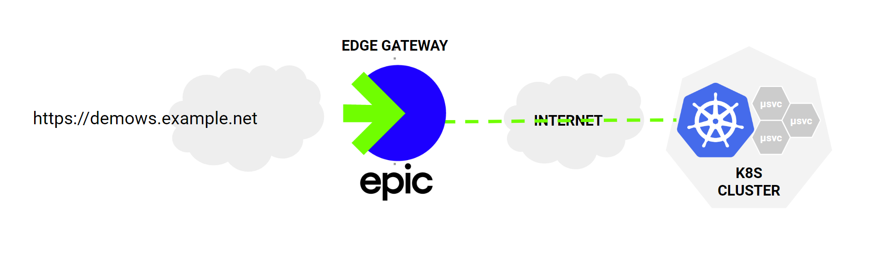
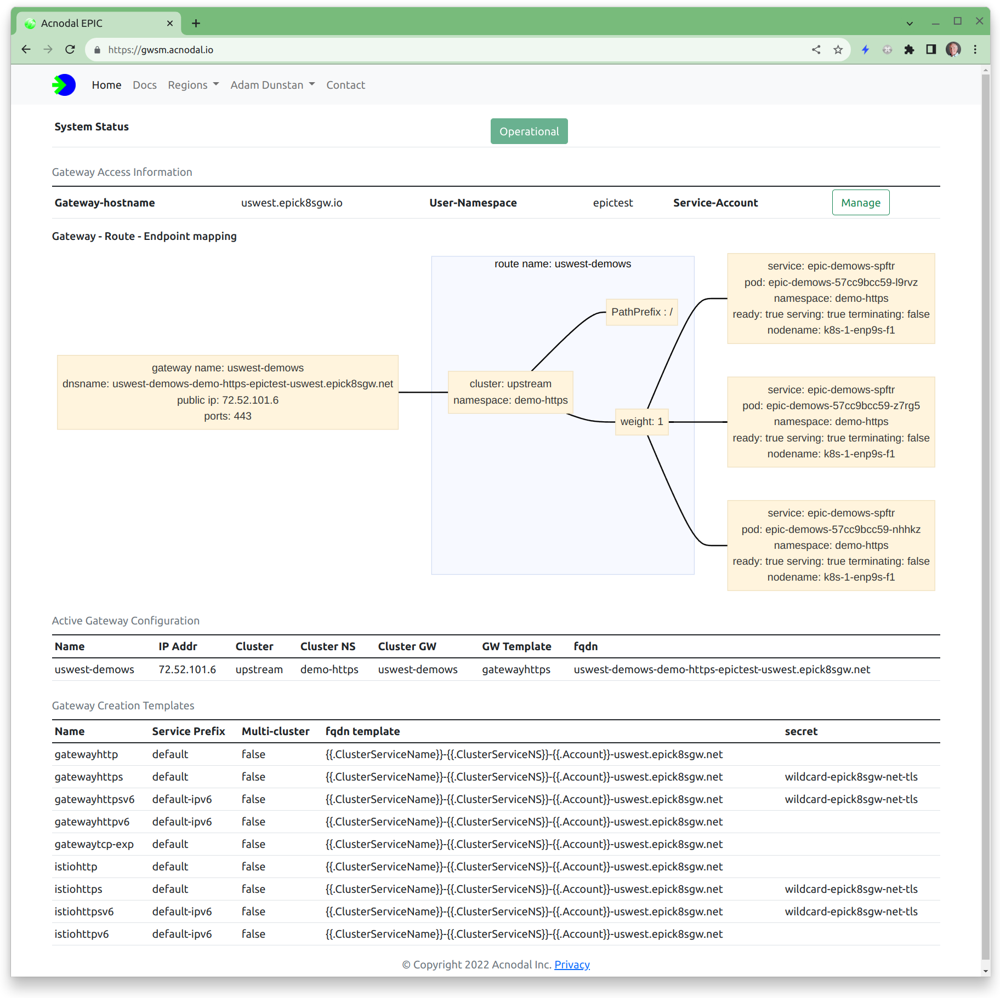

+++
title = "API Gateway for Kubernetes"
linkTitle = "Documentation"

[[cascade]]
type = "docs"

  [cascade._target]
  path = "/**"

+++

EPIC is an API Gateway Platform designed for and built with Kubernetes.

 

The Platform consists of 4 components

1. EPIC Gateway Cluster.
2. k8s Gateway Controller.
3. Linux Gateway Controller.
4. Gateway Service Manager.

Together they create a platform for providing API Gateway services to k8s cluster users.  The platform is designed to provide Gateway-as-a-Service.  Each user or group of users can create Gateways on demand based from their k8s *workload clusters* from templates defined in the EPIC Cluster.  These gateways are contained in their user namespace and consist of one or more Envoy proxy instances distributed over Cluster nodes (if you have multiple nodes in the EPIC cluster).  

The platform is ideal for organizations using **Namespace-as-a-Services** because it uses the [k8s Gateway API](https://gateway-api.sigs.k8s.io/).  Unlike the Service/Ingress API combination gateways and their associated routes are namespaced resources that can optionally be shared with other namespaces making it easy to operate many applications on a single cluster each with its own unique gateway and associated routing rules.

Hosting the Gateway outside of the *workload clusters* is an important difference in this platform architecture.  It provides inherent isolation security, avoiding any possibility of lateral movement.  The Gateway Platform also supports multicluster/multicloud deployments enabling gateways to be shared among multiple clusters in different locations offering unique scale and redundancy options.

Requests are forwarded from the Gateway Proxy instances directly to workload PODs using transport encapsulation developed using eBPF and based upon Generic UDP encapsulation.  This transport contained in both the EPIC cluster and the k8s/linux controller is designed to transit private network address spaces and firewalls enabling k8s clusters to be located at Cloud providers or in private datacenters.

The platform has been designed to support public cloud providers and had been tested with **AWS**, **GCP** and **Azure**, as well as with popular k8s downstreams like **Redhat Openshift**, **Rancher**, **k3s** and others

## EPIC Gateway Cluster
The EPIC Gateway Cluster is based upon a k8s cluster built for purpose from k8s upstream.  Its components automated the deployment of Gateways that consist of envoy instances in created in the authorized users namespace.  Each gateway is created from a template that includes the cluster, network and envoy configuration.  Templates can be created to provide difference services or security postures.  The templates are called by the k8s/linux controller when the user creates a gateway.  

Once created by the user, based upon the template

* IP Address allocated to Gateway from defined IPAM range
* Firewall rules created for defined ports
* Envoy Proxy instances created
* Envoy configuration created, verified, loaded and stored
* Routing advertises new address (BGP by default)

The Gateway address will now be visible in the cluster and routes can be added that will update the EPIC clusters upstream networking configuration and the Envoy configurations to direct requests to targeted PODs.

To monitor the EPIC Gateway Cluster, add the Prometheus controller and configure it to find Envoy instances and a complete picture of the operation of the cluster is provided.

EPIC is a k8s cluster, any tools currently in use can be integrated.

## k8s Gateway Controller
The Gateway Controller is installed on *k8s workload clusters*.  It enables cluster users to create Gateways and routes.  It uses the standard Kubernetes GatewayAPI with implementation specific extensions to integrate with the EPIC Gateway.  

Once the controller is installed, Gateway Class Configurations and Gateway Classes are created.  The Gateway Class Config is the EPIC specific configuration and contains the address of the EPIC gateway cluster, user account information and the name of the template that will be used to create the Gateway and its proxy instances.  The GatewayClass is part of the standard GatewayAPI and makes the ability to create a Gateway available in the cluster.

To create a Gateway, a cluster user defines a gateway referencing the EPIC controller and the gatewayclass.  Gateways are namespaced objects and by default can only be access from that namespace, the gateway configuration can contain permissions to share the gateway across namespaces in the cluster

Once the gateway object is created, EPIC creates the Gateway and it's associated proxies allocating and returning the IP address and/or DNS name for the gateway.  To use the gateway routes are created referencing the gateway and services associated with the application PODs.  EPIC supports http routes and TCP routes.  

If multicluster is defined in the EPIC gateway template, a Gateway can be created that shares a previously created gateway in a different workload cluster.

EPIC and the Gateway controller implement a UDP encapsulation transport that transports requests.  The outer addresses are the target public addresses while the inner addresses reference the POD CNI addresses implementing direct to POD transport

## Linux Gateway Controller
The Linux Gateway Controller follows the same model as the k8s Gateway Controller but can be installed on Linux hosts without k8s or containers.  It can be used as a mechanism to integrate other hosts into an application accessed via the gateway.  (note that static endpoints can also be defined in the envoy configuration in the EPIC gateway) With some configuration it can also be used to provide access to the KubeAPI to externally access kubectl functionality.  

## Gateway Service Manager

The platform is ideally suited to provide a Gateway-as-a-Service infrastructure.  

The Gateway Service Manager can be run on the same or a different cluster.  It provides a simple GUI interface displaying the configuration templates and the configuration of active gateways.  It is namespace based and integrations with GitHUB using OAUTH to dynamically create customer accounts.  In particular, the Gateway Service Manager provides a graphical visualization of each gateway making it easy to understand and troubleshot the configuration of any gateway.

