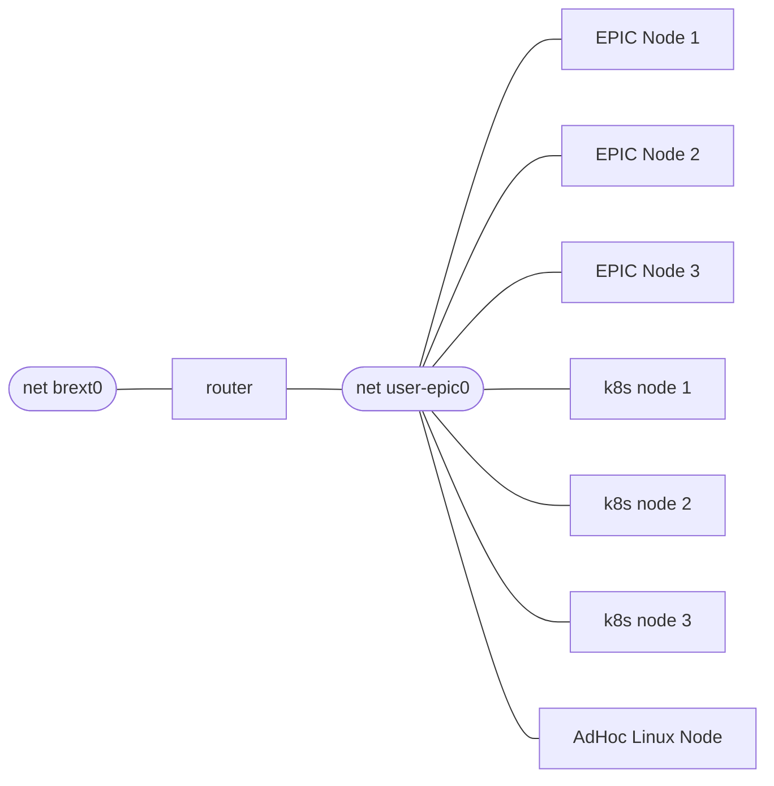

## Multinode
The Multinode Vagrant scripts create a more representative set of nodes including a router.  The vagrant scripts create the VMs ready to install 3 node EPIC and a 3 node workload cluster however unlike the single node mechanism, the installation of multinode does not install EPIC and the workload k8s cluster.  The EPIC installation instructions can be found [here](/epic/install).  Use your favorite k8s distribution to create the 3 node workload cluster.



## Setup

### Host Network Configuration

During the router VM creation the internal bridge shown about as user-epic0 is created.  This network uses the prefix 192.168.254.0/24
The router VM connects to the host via ```brext```, this bridge needs to be connected to a host interface.


```
# cat /etc/netplan/00-config.yaml
network:
  ethernets:
    enp8s0f0:
      dhcp4: false
      link-local: []
      dhcp6: false
      accept-ra: false
  bridges:
    brext0:
      interfaces:
      - enp8s0f0
  version: 2

```

The netplan configuration on the router VM is configured to use DHCP on the veth attached to brext0.  This can be easily changed in the router VM.


The multinode setup is installed uses the same repo as the single node, the order of starting vms is different.  In addition, the multinode requires your private key and a known_hosts file to be present in your .ssh directory.

The router VM activation script create the internal bridge interface used by all of the nodes and connected to the router VM. 


```sh
git clone --recurse-submodules https://github.com/epic-gateway/dev-test-environment.git
cd dev-test-environment/multinode
vagrant up router #<= bring up the router VM first...
vagrant up #<= create the rest of the VMs
```

To connect to the nodes via the router from your host directly.

```
$ vagrant ssh router -- ip -br addr show dev eth2
eth2             UP             172.30.255.237/24

$ sudo ip route add 192.168.254.0/24 via 172.30.255.237

$ ping 192.168.254.11 <= epic1

```

The next steps are to install EPIC and a workload cluster.  All of these nodes have ansible scripts.  You can choose to install all of the nodes or some of them using these scripts

```bash
git clone https://github.com/epic-gateway/ansible-playbook.git
```


