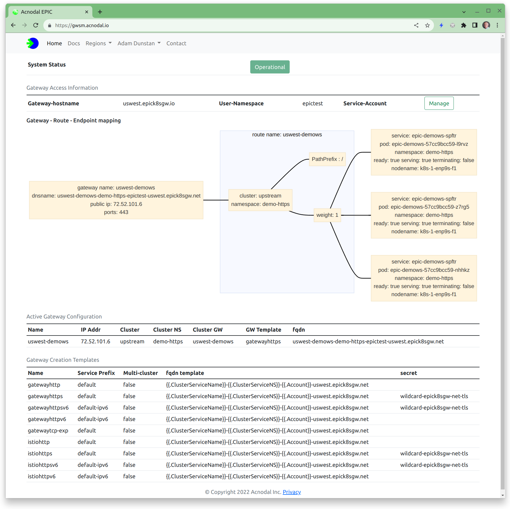

## Epic Gateway Service Manager

The Epic Gateway Server manager is a working example the user interface for EPIC Gateways.  We found that one of the key problems was understanding how a gateway as constructed from its components, we created a simple visualization that displays how a gateway is constructed and connected to clusters with the capability to drill down to specific gateway configuration information from both the cluster and the gateway and its Envoy instances.  All of the configuration elements used to create gateways can be viewed including the Envoy configuration used by the Envoy proxy instances.


<p align="center">

</p>


This version was used to provide a Gateway-as-a-Service for a demonstration platform.  It includes user manuals and guides.  Modify this version to suit your requirements.

This version allows any GITHUB user to create an account on the gateway.  The creation process creates the user namespace and copies gateway templates as defined in the configuration files into the user namespace.  By default each user is limited to creating two gateways, this can be overridden using a configuration parameter in the users namespace account configuration

The Gateway Service Manager stores account information and user notices in MongoDB, an instance of Mongo is required to use the Gateway Service Manager

It was developed to be run on a separate cluster from the EPIC gateway but there is no reason it could not be run on the same cluster.  The Gateway Service Manager can support multiple clusters allowing users to select the cluster they wish the gateway to be created.

Users can view their templates and gateways however cannot modify those configuration.  Adding the ability to configure would be a relatively simple development.


## Components
The Gateway Service Manager is a simple Javascript/express application.  It uses a simple renderer [ejs](https://ejs.co/)

The [Passport](https://www.passportjs.org/) library is used for OATH and support for GITHUB is implemented.  The Passport library supports many other forms of authentication making it straight forward to add additional types of auth to the platform

MongoDB is used as the account information database.

The [Kubernetes Javascript client](https://github.com/kubernetes-client/javascript) is used with the epic k8s cluster including configuring custom resources


## Setup & installation information

Clone the [source directory from github](https://github.com/epic-gateway/service-manager)


Configuration & k8s Certificates
The configuration is stored in a configmap called egs-config loaded into each of the gwsm-pods.  There is a node.js config file in JSON format and k8s certificate.  Create a configmap from a directory containing the required node.js and k8s config files using:

```bash
$kubectl -n egs-server create configmap egs-server --from-file=.

```
{}

The application uses passport.js middleware to deal with OAUTH.  You will need to configure support for Auth.  Support for GITHUB is provided, others can be added.  If you choose to use GITHUB auth when setting up the application, the homepage URL and redirect should be http: not https: irrespective of if tls is enabled or not.  If its set to https: you will get a redirect error.
{}

### Installation

1.  Create the configmap
2.  Create the container and store it in your registry of choice
3.  Install using the files in the deploy directory

*The deploy directory includes an ingress configuration, this is useful if the GWSM is on the same cluster as the EPIC gateway, however if its on a different cluster EPIC can be used to create a gateway for the GWSM*


## Test/Dev Environements
_Testing can be tricky because of the oauth flow._

1. The node.js config module is used to pass configuration variables.  Note that there is dev.json in the /config
2. dev.json contains different Oauth credentials, you can edit or create one for your purposes  The redirects are set to use localhost:8080  This is configured under the settings/Developer in github.  You can take a look at gwsm-test as an example
3. dev.json also specifies a different mongodb backend.  You will need to have a backend server running to develop and test the application. 

Starting your code with  $ NODE_ENV=dev node app.js

Connect your browser to localhost:8080 and ensure that the redirects in your oauth profile on github also redirect to localhost:8080


## User Manuals and Guides
The user manuals describe how users can create gateways when using the Gateway Service Manager as well as some associated use case guides.  