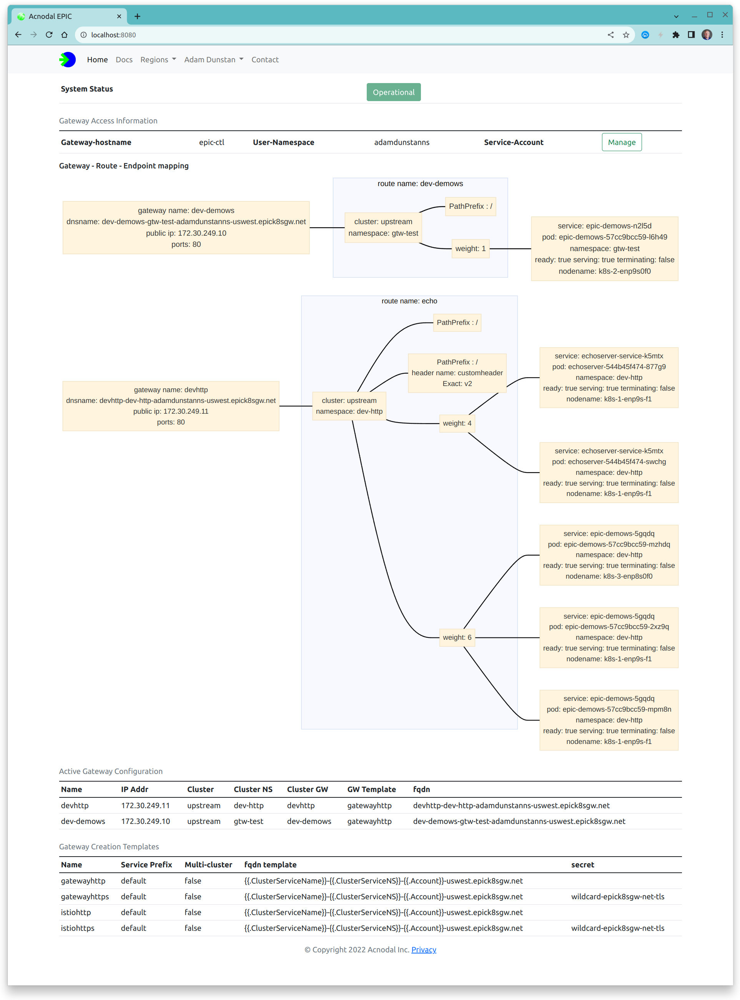
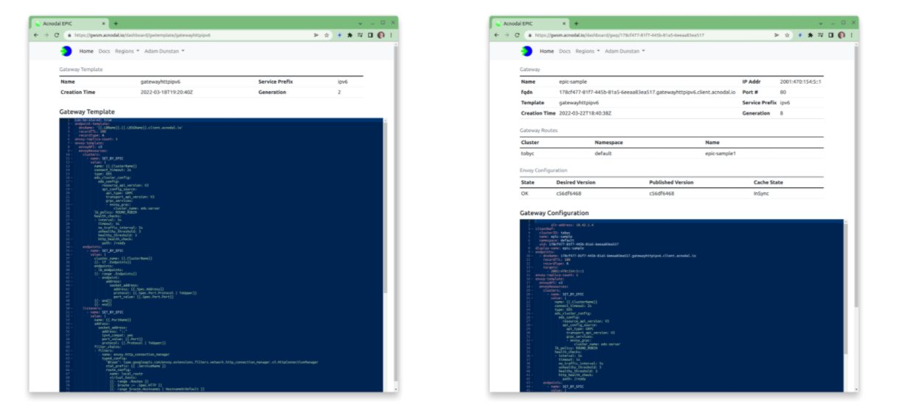
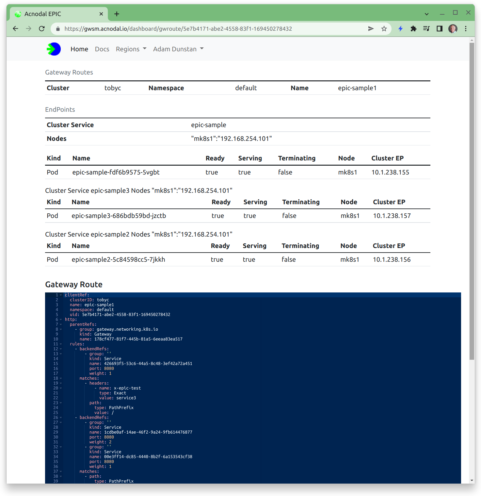

EPIC is an Application and API Gateway designed for microservice applications hosted on Kubernetes.  The EPIC platform creates Gateways that consist of microservice envoy proxy engines.  Behind the scenes, the EPIC gateway is a purpose-built k8s cluster orchestrating network facing and cluster facing configuration necessary to automate the creation of Gateways at the request of the Gateway Controller. 

<p align="center">

</p>


## Gateway Templates

EPIC creates Gateways and proxy instances in user-namespaces.  Contained in each namespace is the primary configuration element of the gateways: the gateway template.  By default there will be a choice of standard templates and additional templates can be added.

The template combines other configuration components such as IP address prefix ranges, DNS configuration, and certificates, with an [Envoy configuration](https://www.envoyproxy.io/docs/envoy/v1.21.4/) to create the required number of proxies required by the application.  Once a Gateway is created, a specific configuration for that gateway is created. Editing this configuration changes the gateway dynamically.


<p align="center">

</p>


## Cluster Endpoints
Gateway creation is initiated by the Gateway Controller, this is a two step process.  The first step creates the EPIC gateway and its instances when the gateway resource is created in the cluster.  When route resources are added in the cluster, the node-controller communicates with the Endpoint controller in EPIC, dynamically crated endpoints for the proxy.  This dynamic behavior allows endpoints to be managed using the k8s API from the cluster, for example, scaling a deployment will result in more endpoints being created in the cluster and EPIC, thereby scaling the application.  These endpoints are displayed as routes in the Gateway Service Manager.  Note that the references in the Gateway Service Manager match the references in the cluster making it easy to show how the paths to cluster resources have been created.


<p align="center">

</p>


### Gateway Configuration
A gateway template combines the Envoy configuration with the configuration of other components.

The template below is one of the defaults found in a new customer namespace.  This is the complete template and includes system information.

|Section                                 | Description
|----------------------------------------|------------------------------------------|
|epic.acnodal.io/owning-serviceprefix: v6| this selects the pool of service prefixes that will be used to add external IP addresses to the gateway.  This example is an IPv6 address.  EPIC supports multiple address pools, in this case the address pool is global, user-namespace based pools can also be configured |
| spec: can-be-shared: yes | This flag indicates that multiple clusters can use this Gateway.  When enabled in the Controller, the cluster creating the Gateway receives a sharing key in the gateway status.  By adding this key to the GatewayClassConfig, creating a gateway in the cluster will not create a new gateway, instead it will add the endpoints to the existing shared gateway.  This is how multi-cloud is provisioned. |
|spec: endpoint-template | This template creates a DNS name that can be added to the DNS.  The gateway configuration is updated to include the address and the generated name of the potential DNS record. |
|envoy-replica-count: 2 | Each Gateway consists of a number of instances of the Envoy proxy.  In the future the the envoy-replica-count will also be configurable using the Gateway Controller Policy in the cluster.  The EPIC cluster places each instance on a different cluster node, advertising both instances to our edge router using BGP, loadbalancing traffic between the instances and providing redundancy |
|envoy-template | A standard yaml based [Envoy configuration](https://www.envoyproxy.io/docs/envoy/v1.21.4/) |
|envoyResources: endpoints: | This part of the configuration is dynamically updated by the endpoint controller.  However additional static endpoints and clusters can be added to combine CDN resources with k8s services |
|envoyResources: clusters | A combination of configuration elements, are shown, the cluster information is provided by the endpoint discovery controller, however other elements such as the lb_policy are configured here |
| envoyResources: listeners | Again a combination of configuration, routes are provided by the endpoint controller and the remaining configuration is provided in the template |
| secrets: | Where TLS is used, the envoy configuration references the Secrets Discovery Server.  The referenced secrets are contained in this configuration element.  Secrets can be either global (wildcard for default https services) or located in the user-names.  EPIC provides a secrets manager based upon Jetstack. |


{}
The Gateway Service Manager does not allow configuration editing at this time  Should you want to try different features or change the configuration, contact your EPIC Gateway administrator.{}


```yaml
apiVersion: epic.acnodal.io/v1
kind: LBServiceGroup
metadata:
  namespace: epic-epictest
  name: gatewayhttpsv6
  labels:
    epic.acnodal.io/owning-account: epictest
    epic.acnodal.io/owning-serviceprefix: v6
    app.kubernetes.io/component: lbservicegroup
    app.kubernetes.io/part-of: epic
spec:
  can-be-shared: yes
  endpoint-template:
    dnsName: "{{.LBName}}.{{.LBSGName}}.client.acnodal.io"
    recordTTL: 180
    recordType: A
  envoy-replica-count: 1
  envoy-template:
    envoyAPI: v3
    serialization: yaml
    nodeID: SET_BY_EPIC
    envoyResources:
      endpoints:
      - name: SET_BY_EPIC
        value: |
          cluster_name: {{.ClusterName}}
          {{- if .Endpoints}}
          endpoints:
          - lb_endpoints:
          {{- range .Endpoints}}
            - endpoint:
                address:
                  socket_address:
                    address: {{.Spec.Address}}
                    protocol: {{.Spec.Port.Protocol | ToUpper}}
                    port_value: {{.Spec.Port.Port}}
          {{- end}}
          {{- end}}
      clusters:
      - name: SET_BY_EPIC
        value: |
          name: {{.ClusterName}}
          connect_timeout: 2s
          type: EDS
          eds_cluster_config:
            eds_config:
              resource_api_version: V3
              api_config_source:
                api_type: GRPC
                transport_api_version: V3
                grpc_services:
                - envoy_grpc:
                    cluster_name: eds-server
          lb_policy: ROUND_ROBIN
          health_checks:
          - interval: 5s
            timeout: 5s
            no_traffic_interval: 5s
            unhealthy_threshold: 3
            healthy_threshold: 3
            http_health_check:
              path: /ready
      listeners:
      - name: SET_BY_EPIC
        value: |
          name: {{.PortName}}
          address:
            socket_address:
              address: 0.0.0.0
              port_value: {{.Port}}
              protocol: {{.Protocol | ToUpper}}
          filter_chains:
          - filters:
            - name: envoy.http_connection_manager
              typed_config:
                "@type": type.googleapis.com/envoy.extensions.filters.network.http_connection_manager.v3.HttpConnectionManager
                stat_prefix: {{ .ServiceName }}
                route_config:
                  name: local_route
                  virtual_hosts:
                  {{- range .Routes }}
                  {{- $route := .Spec.HTTP }}
                  {{- range $route.Hostnames | HostnameOrDefault }}
                  - name: "{{ . }}"
                    domains:
                    - "{{ . }}"
                    {{- if $route.Rules}}
                    routes:
                    {{- range $route.Rules}}
                    - route:
                        weighted_clusters:
                          clusters:
                          {{- range .BackendRefs}}
                          - name: {{ .Name }}
                            weight: {{ .Weight }}
                          {{- end }}
                          total_weight: {{ .BackendRefs | RefWeightsTotal }}
                      {{- if .Matches }}
                      match:
                      {{- range .Matches }}
                        {{- if .Path }}
                        prefix: "{{ .Path.Value }}"
                        {{- end }}
                        {{- if .Headers }}
                        headers:
                        {{- range .Headers }}
                        - name: "{{ .Name }}"
                          string_match:
                          {{- if .Type | HeaderTypeRegex }}
                            safe_regex:
                              google_re2: {}
                              regex: "{{ .Value }}"
                          {{- else }}
                            exact: "{{ .Value }}"
                          {{- end }}
                        {{- end }}
                        {{- end }}
                      {{- end }}
                      {{- end }}
                    {{- end }}
                    {{- end }}
                  {{- end }}
                  {{- end }}
                http_filters:
                - name: envoy.filters.http.router
            transport_socket:
              name: envoy.transport_socket.tls
                typed_config:
                  "@type": type.googleapis.com/envoy.extensions.transport_sockets.tls.v3.DownstreamTlsContext
                  common_tls_context:
                    tls_certificate_sds_secret_configs:
                      - name: gwtmpl-https-cert
                        sds_config:
                          resource_api_version: V3
                          ads: {}
      secrets:
      - name: gwtmpl-https-cert
        ref:
          name: gwtmpl-https-cert
          namespace: epic-epictest
```
