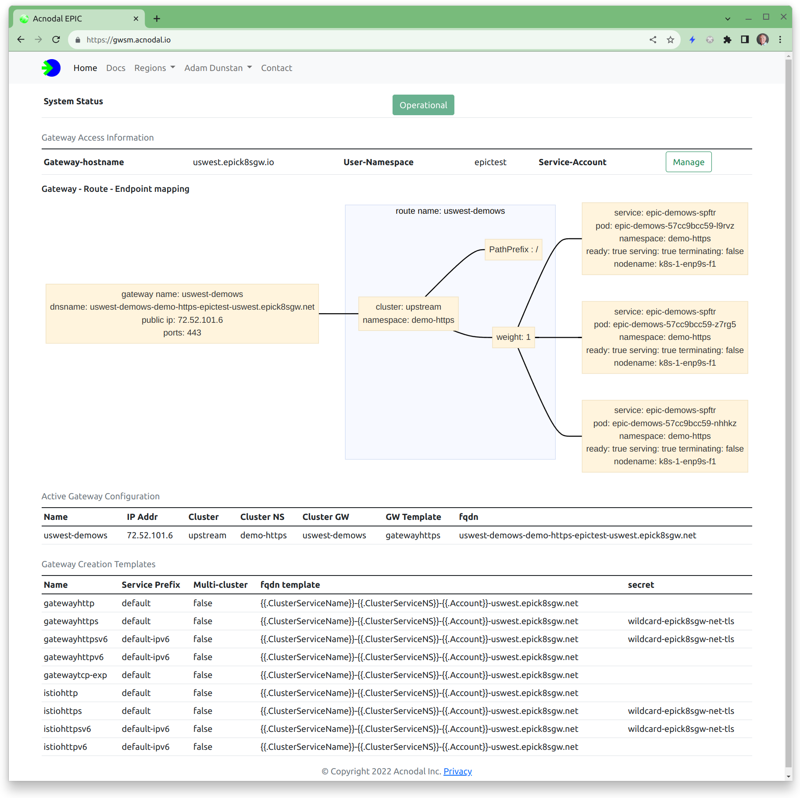

EPIC is a Gateway for Kubernetes.  It uses the *new* gateway API to simplify the administration and creation of API and Application Gateways.  The Gateway, EPIC, works with the EPIC Gateway Controller installed on the k8s cluster.

It simplifies the provisioning of API gateways; simply install the controller and create a gateway.  No need to add an Ingress controller and a Load Balancer, and configure all of the components in-between.  EPIC creates a gateway,  connects it to the Internet, updates DNS records and then forwards requests directly to the PODs hosting the applications.

EPIC can be used with Public Cloud providers as an alternative to their limited-functionality Ingress controllers. The Gateway Controller can be installed in any cloud with any Kubernetes distribution.

The EPIC Gateway operates outside of the Kubernetes cluster, so we made it Multicloud/Multicluster.  Using EPIC you can create an application that spans multiple clusters or Cloud providers. Multicloud/Multicluster offers scale, reliability and operational benefits that are hard to get in existing solutions.

Our [Getting Started Video](https://www.youtube.com/watch?v=G1e546uUv9I) (7 minutes) explains the GatewayAPI, EPIC and demonstrates creating a gateway, a great place to start

