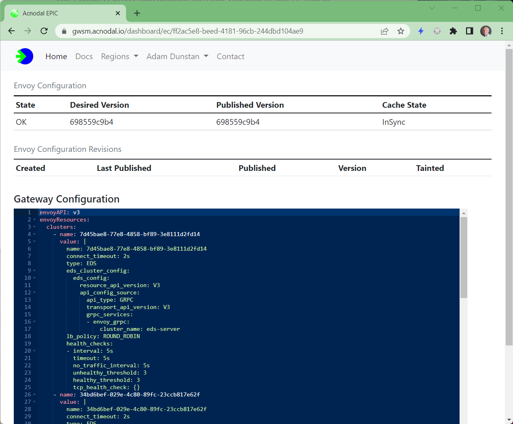

The proxy component of an EPIC gateway uses the [Envoy Proxy](https://www.envoyproxy.io).   Each Gateway consists of one or more managed Envoy instances providing redundancy and scale.  EPIC configurations provide complete access to the native Envoy configuration and all of Envoy's features.

```mermaid
graph LR
  style A1 fill:#6633FF,color:#fff
  style A2 fill:#6633FF,color:#fff
  A1[Envoy Proxy Instance] --- B
  A2[Envoy Proxy Instance] --- B
  A1 --- C
  A2 --- C
  B[Primary Controller] --- D
  C[Endpoint Controller] --- D
  D[EPIC API Access] --- E
  E[Gateway Controller]
  subgraph EPIC
  style EPIC fill: #00CC00
  A1
  A2
  B
  C
  D
    subgraph Gateway
    style Gateway fill:#006600,color:#fff 
    A1
    A2
    end
  end
  subgraph k8s-Cluster
  style k8s-Cluster fill:#6699ff,color:#fff
  E
  end
  ```

Gateways are created on demand by the Gateway Controller installed in the cluster.  A gatewayClassConfig/gatewayClass specifies the gateway configuration that will be created in EPIC when a Gateway object referencing a GatewayClass is created.  In each gatewayClassConfig a gateway template is defined, this provides the blueprint for the gateway to be created.

### Controllers
Each user account has its own Envoy configuration controllers.  There is a primary controller that creates a gateway from a template, and second controller that provides EndPoint information.  This mirrors the behavior of the GatewayAPI where a Gateway is created separately from Routes.  Gateways are relatively long lived objects while Endpoints can be changed often based upon scaling application PODs in clusters.

### Envoy gateway templates & configurations
The templates and resulting gateway configurations include [Envoy configurations](https://www.envoyproxy.io/docs/envoy/v1.21.4/), not an abstraction of the Envoy configuration.  This allows any feature in any release of Envoy to be used to create an EPIC Gateway.  

{}
EPIC can host a your specific version and/or build of Envoy that contains only the filters and extension required for your use case.
{}  


An operational gateway configuration has the same structure as a template and can be edited dynamically affecting all instances of the operational gateway

```yaml
apiVersion: epic.acnodal.io/v1
kind: GWProxy
spec:
  clientRef:
    clusterID: upstream-private
    name: uswest-gtwapi
    namespace: demoapi
    uid: ff2ac5e8-beed-4181-96cb-244dbd104ae9
  display-name: uswest-gtwapi
  endpoints:
  - dnsName: uswest-gtwapi-demoapi-epictest-uswest.epick8sgw.net
    recordTTL: 180
    recordType: A
    targets:
    - 72.52.101.1
  envoy-replica-count: 1
  envoy-template:
    envoyAPI: v3
    envoyResources:
      clusters:
      - name: SET_BY_EPIC
        value: |
          name: {{.ClusterName}}
          connect_timeout: 2s
          type: EDS
          eds_cluster_config:
            eds_config:
              resource_api_version: V3
              api_config_source:
                api_type: GRPC
                transport_api_version: V3
                grpc_services:
                - envoy_grpc:
                    cluster_name: eds-server
          lb_policy: ROUND_ROBIN
          health_checks:
          - interval: 5s
            timeout: 5s
            no_traffic_interval: 5s
            unhealthy_threshold: 3
            healthy_threshold: 3
            tcp_health_check: {}
      endpoints:
      - name: SET_BY_EPIC
        value: |
          cluster_name: {{.ClusterName}}
          {{- if .Endpoints}}
          endpoints:
          - lb_endpoints:
          {{- range .Endpoints}}
            - endpoint:
                address:
                  socket_address:
                    address: {{.Spec.Address}}
                    protocol: {{.Spec.Port.Protocol | ToUpper}}
                    port_value: {{.Spec.Port.Port}}
          {{- end}}
          {{- end}}
      listeners:
      - name: SET_BY_EPIC
        value: |
          name: {{.PortName}}
          address:
            socket_address:
              address: "::"
              ipv4_compat: yes
              port_value: {{.Port}}
              protocol: {{.Protocol | ToUpper}}
          filter_chains:
          - filters:
            - name: envoy.http_connection_manager
              typed_config:
                "@type": type.googleapis.com/envoy.extensions.filters.network.http_connection_manager.v3.HttpConnectionManager
                stat_prefix: {{ .ServiceName }}
                server_name: epicuswest
                add_user_agent: true
                use_remote_address: true
                via: epicuswest
                route_config:
                  name: local_route
                  virtual_hosts:
                  {{- range .Routes }}
                  {{- $route := .Spec.HTTP }}
                  {{- range $route.Hostnames | HostnameOrDefault }}
                  - name: "{{ . }}"
                    domains:
                    - "{{ . }}"
                    {{- if $route.Rules}}
                    routes:
                    {{- range $route.Rules}}
                    {{- $rule := . }}
                    {{- if .Matches }}
                    {{- range .Matches }}
                    - route:
                        weighted_clusters:
                          clusters:
                          {{- range $rule.BackendRefs}}
                          - name: {{ .Name }}
                            weight: {{ .Weight }}
                          {{- end }}
                          total_weight: {{ $rule.BackendRefs | RefWeightsTotal }}
                      match:
                        {{- if .Path.Type | PathTypePathPrefix }}
                        prefix: "{{ .Path.Value }}"
                        {{- end }}
                        {{- if .Path.Type | PathTypeExact }}
                        path: "{{ .Path.Value }}"
                        {{- end }}
                        {{- if .Headers }}
                        headers:
                        {{- range .Headers }}
                        - name: "{{ .Name }}"
                          string_match:
                          {{- if .Type | HeaderTypeRegex }}
                            safe_regex:
                              google_re2: {}
                              regex: "{{ .Value }}"
                          {{- else }}
                            exact: "{{ .Value }}"
                          {{- end }}
                        {{- end }}
                        {{- end }}
                    {{- end }}
                    {{- end }}
                    {{- end }}
                    {{- end }}
                  {{- end }}
                  {{- end }}
                http_filters:
                - name: envoy.filters.http.bandwidth_limit
                  typed_config:
                    "@type": type.googleapis.com/envoy.extensions.filters.http.bandwidth_limit.v3.BandwidthLimit
                    stat_prefix: bandwidth_limiter_default
                    enable_mode: REQUEST_AND_RESPONSE
                    limit_kbps: 1000
                    fill_interval: 0.1s
                - name: envoy.filters.http.router
            transport_socket:
              name: envoy.transport_socket.tls
              typed_config:
                "@type": type.googleapis.com/envoy.extensions.transport_sockets.tls.v3.DownstreamTlsContext
                common_tls_context:
                    tls_certificate_sds_secret_configs:
                      - name: wildcard-https-cert
                        sds_config:
                          resource_api_version: V3
                          ads: {}
      secrets:
      - name: wildcard-https-cert
        ref:
          name: wildcard-epick8sgw-net-tls
          namespace: epic-epictest
```

The Envoy resource and template structure mirrors a [native Envoy configuration](https://www.envoyproxy.io/docs/envoy/v1.21.4/) with Clusters, Endpoints, Listeners and Secrets.  In addition, the configuration includes Go templates ( {{- }} ) used to dynamically update the configuration from changes such as endpoints and httpRoutes from the cluster.  The gateway above was created from the default gatewayhttps template that is loaded on account creation.

### Envoy Configuration validation and version control
The reason **most implementations** hide Envoy's native configuration interface is that it can be complex and error prone resulting in non-operational proxy engines.  The Configuration Controller alleviates this problem by checking the configuration before it's applied to the proxy engines.  If the configuration fails verification, the existing configuration is left in place and the failing configuration is marked.  The Configuration Controller also stores previous versions to assist in version control.

The Envoy component of the configuration, as applied to each of the Envoy proxies can be viewed.  In this case the Go Templates viewed in the Template and Gateway configuration are completed with updates from the Endpoint controller.

```yaml
apiVersion: marin3r.3scale.net/v1alpha1
kind: EnvoyConfig
spec:
  envoyAPI: v3
  envoyResources:
    clusters:
    - name: 34bd6bef-029e-4c80-89fc-23ccb817e62f
      value: |
        name: 34bd6bef-029e-4c80-89fc-23ccb817e62f
        connect_timeout: 2s
        type: EDS
        eds_cluster_config:
          eds_config:
            resource_api_version: V3
            api_config_source:
              api_type: GRPC
              transport_api_version: V3
              grpc_services:
              - envoy_grpc:
                  cluster_name: eds-server
        lb_policy: ROUND_ROBIN
        health_checks:
        - interval: 5s
          timeout: 5s
          no_traffic_interval: 5s
          unhealthy_threshold: 3
          healthy_threshold: 3
          tcp_health_check: {}
    - name: 70196186-404f-442e-b5ac-6e563620e56c
      value: |
        name: 70196186-404f-442e-b5ac-6e563620e56c
        connect_timeout: 2s
        type: EDS
        eds_cluster_config:
          eds_config:
            resource_api_version: V3
            api_config_source:
              api_type: GRPC
              transport_api_version: V3
              grpc_services:
              - envoy_grpc:
                  cluster_name: eds-server
        lb_policy: ROUND_ROBIN
        health_checks:
        - interval: 5s
          timeout: 5s
          no_traffic_interval: 5s
          unhealthy_threshold: 3
          healthy_threshold: 3
          tcp_health_check: {}
    - name: 7d45bae8-77e8-4858-bf89-3e8111d2fd14
      value: |
        name: 7d45bae8-77e8-4858-bf89-3e8111d2fd14
        connect_timeout: 2s
        type: EDS
        eds_cluster_config:
          eds_config:
            resource_api_version: V3
            api_config_source:
              api_type: GRPC
              transport_api_version: V3
              grpc_services:
              - envoy_grpc:
                  cluster_name: eds-server
        lb_policy: ROUND_ROBIN
        health_checks:
        - interval: 5s
          timeout: 5s
          no_traffic_interval: 5s
          unhealthy_threshold: 3
          healthy_threshold: 3
          tcp_health_check: {}
    listeners:
    - name: TCP-443
      value: |
        name: TCP-443
        address:
          socket_address:
            address: "::"
            ipv4_compat: yes
            port_value: 443
            protocol: TCP
        filter_chains:
        - filters:
          - name: envoy.http_connection_manager
            typed_config:
              "@type": type.googleapis.com/envoy.extensions.filters.network.http_connection_manager.v3.HttpConnectionManager
              stat_prefix: ff2ac5e8-beed-4181-96cb-244dbd104ae9
              server_name: epicuswest
              add_user_agent: true
              use_remote_address: true
              via: epicuswest
              route_config:
                name: local_route
                virtual_hosts:
                - name: "*"
                  domains:
                  - "*"
                  routes:
                  - route:
                      weighted_clusters:
                        clusters:
                        - name: 7d45bae8-77e8-4858-bf89-3e8111d2fd14
                          weight: 1
                        total_weight: 1
                    match:
                      prefix: "/api"
                      headers:
                      - name: "epic"
                        string_match:
                          exact: "dev1"
                  - route:
                      weighted_clusters:
                        clusters:
                        - name: 34bd6bef-029e-4c80-89fc-23ccb817e62f
                          weight: 1
                        total_weight: 1
                    match:
                      prefix: "/api"
                  - route:
                      weighted_clusters:
                        clusters:
                        - name: 70196186-404f-442e-b5ac-6e563620e56c
                          weight: 1
                        total_weight: 1
                    match:
                      prefix: "/"
              http_filters:
              - name: envoy.filters.http.bandwidth_limit
                typed_config:
                  "@type": type.googleapis.com/envoy.extensions.filters.http.bandwidth_limit.v3.BandwidthLimit
                  stat_prefix: bandwidth_limiter_default
                  enable_mode: REQUEST_AND_RESPONSE
                  limit_kbps: 1000
                  fill_interval: 0.1s
              - name: envoy.filters.http.router
          transport_socket:
            name: envoy.transport_socket.tls
            typed_config:
              "@type": type.googleapis.com/envoy.extensions.transport_sockets.tls.v3.DownstreamTlsContext
              common_tls_context:
                  tls_certificate_sds_secret_configs:
                    - name: wildcard-https-cert
                      sds_config:
                        resource_api_version: V3
                        ads: {}
    secrets:
    - name: wildcard-https-cert
      ref:
        name: wildcard-epick8sgw-net-tls
        namespace: epic-epictest
  nodeID: epic-epictest.ff2ac5e8-beed-4181-96cb-244dbd104ae9
  serialization: yaml
```

### Viewing the Envoy Configuration resulting from Gateway Creation
All of the configuration information is visible via the Gateway Service Manager. (CLI interface will be available in the future).  Using the Gateway Service Manager, it's easy to inspect the resuting Envoy configuration from Gateway creation.


<p align="center">

</p>
