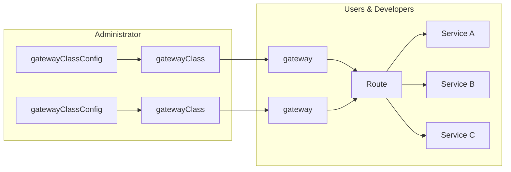
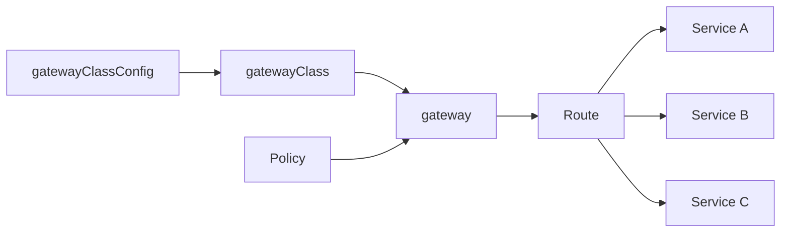

The Gateway Controller is an implementation of the emerging standard Gateway API.  It provides API gateway functionality and is a replacement/alternative to the combination LoadBalancer/Ingress API solution. Acnodal developed the EPIC Gateway Controller using the k8s Gateway API enabling k8s clusters to instantiate and manage API gateways from the cluster.


The definition of Gateways is logically separated into activities: the creation of GatewayClassConfig & GatewayClass, and the creation of the gateway and its associated routes.

{}
The Gateway SIG maintains documentation on the Gateway API as a reference for developers and Gateway users.  It provide background on why the Gateway API was developed, its key features and examples of its use.  Reading is recommended in conjunction with our documentation [Kubernetes Gateway API](https://gateway-api.sigs.k8s.io/).
{}


## Gateway Definition
* GatewayClassConfig.  This is the configuration of the Gateway being used.  It's specific to the Gateway provider and contains the parameters necessary to configure the Gateway.  In the case of EPIC this configuration contains the configuration required to create a Gateway in an EPIC cluster using the specific parameters contained in the configuration

* GatewayClass.  This provides a binding to the GatewayClassConfig and is the gateway name used to create gateways.  This configuration in the case of an EPIC gateway is simple

```yaml
apiVersion: gateway.networking.k8s.io/v1alpha2
kind: GatewayClass
metadata:
  name: epic-sample
spec:
  controllerName: acnodal.io/epic
  parametersRef:
    name: epic-sample
    namespace: default
    group: puregw.acnodal.io
    kind: GatewayClassConfig

```
Note the use of *references*, they are used throughout the gateway configuration.

## Gateway Creation
### Gateway 
This definition creates the gateway. In addition to a reference to the GatewayClass, it contains basic networking information.

```yaml
apiVersion: gateway.networking.k8s.io/v1alpha2
kind: Gateway
metadata:
  name: epic-sample
spec:
  gatewayClassName: epic-sample
  listeners:
  - protocol: HTTP
    port: 80
    name: sample-web-gw
```


### Routes  
There are four types of routes covered it the specification.  EPIC fully supports HTTPRoute.  All other route types are planned.

Routes are key to the operation of the system, they define the connection between gateways and Kubernetes services exposing backend applications.  A single route can connect to multiple services and multiple gateways.  Routes for the same application can be created in multiple configuration files, the references are used to merge the resulting route configuration applied in the EPIC gateway.  


```yaml
apiVersion: gateway.networking.k8s.io/v1alpha2
kind: HTTPRoute
metadata:
  name: epic-sample1
spec:
  parentRefs:
  - name: epic-sample
  rules:
  - matches:
    - path:
        type: PathPrefix
        value: /important
    - headers:
      - name: x-epic-test
        value: service3
    backendRefs:
    - name: epic-sample3
      port: 8080
  - backendRefs:
    - name: epic-sample
      port: 8080
      weight: 2
    - name: epic-sample2
      port: 8080

```

### Services  
Route backendRef provide a binding to Services providing access to the PODs as with any other form of access.

```yaml
apiVersion: gateway.networking.k8s.io/v1alpha2
kind: HTTPRoute
metadata:
  name: epic-sample1
spec:
  parentRefs:
  - name: epic-sample
  rules:
  - matches:
    - headers:
      - name: x-epic-test
        value: service3
    backendRefs:
    - name: epic-sample3
      port: 8080
  - backendRefs:
    - name: epic-sample
      port: 8080
      weight: 2
    - name: epic-sample2
      port: 8080
```


## Policy
Policies are attached to a k8s Gateway and provide a mechanism to update or change the configuration of the Gateway.  In the case of EPIC, the configuration of the gateway is derived from a template in the EPIC system referenced by the GatewayClassConfig.  The policy mechanism will enable that configuration to be updated by the cluster operator based on RBAC rules.  EPIC does not support policy at this time; all Gateway configuration is undertaken at EPIC.  Acnodal will introduce Policy supporting specific configuration changes that can be delegated to the cluster in the future.




