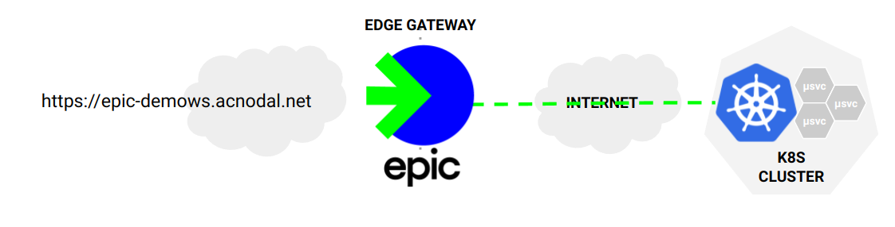
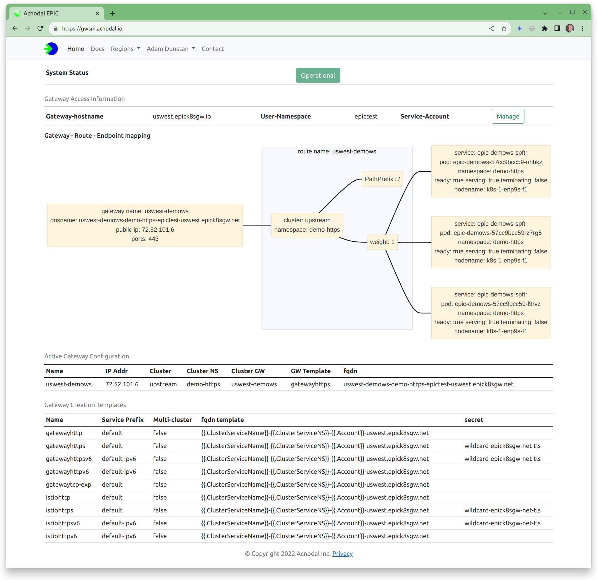
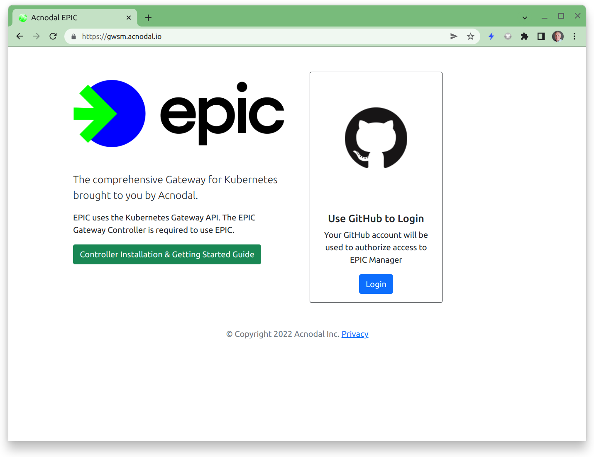
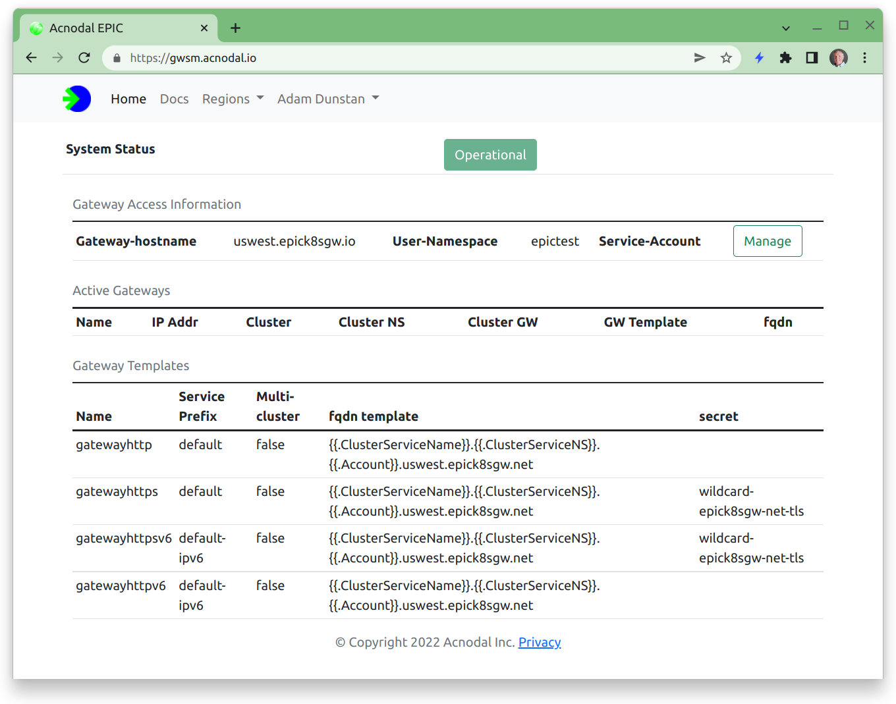
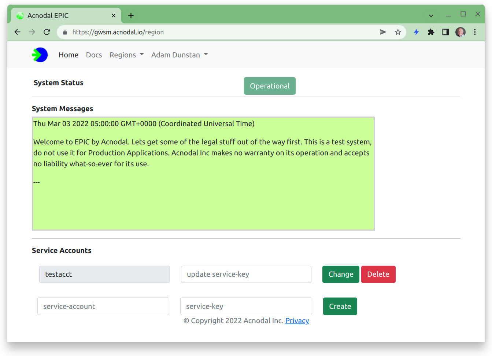
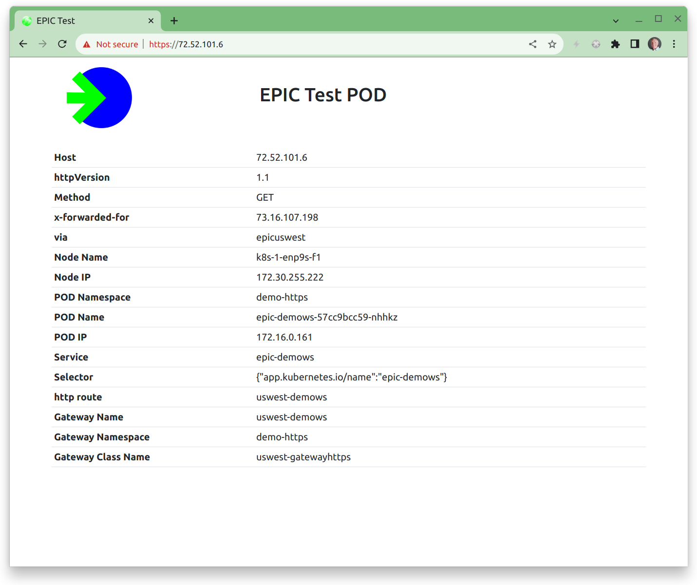

This Getting Started Guide provides the steps required to add a Gateway to an application in your Kubernetes Cluster.

<p align="center">

</p>


These instructions setup access to a simple test application.  Once configured, the test application is exposed using a DNS name derived from the Gateway template, in this case using the service name and other account information.  

The resulting Gateway will be displayed in the Gateway Service Manager.

<p align="center">

</p>


The instructions are broken into three steps:

1.  System Administrator.  Install & Configure the Gateway Controller
2.  Developer.  Install Application (optional)
3.  Developer. Create Gateway & application routes


Let's get started....


### Prerequisites

* Kubernetes cluster.  The cluster can be provisioned by a Cloud provider or locally provisioned.   The Gateway Controller uses IPv4 to communicate with the EPIC Gateway.  At the moment we support only IPv4 or dual-stack clusters, IPv6-only clusters are not supported.  The Gateway controller does not support ARM hosts at this time.  There are no other specific cluster requirements.

* Active account on the EPIC Gateway Service.  An active account will provide the information needed to configure the Gateway Controller.


### Create an EPIC Account

Creating an EPIC account is simple, navigate to your Gateway Service Manager URL

<p align="center">

</p>


Your account is created by logging in with your GitHub Account (the magic of OAuth).  By default your account will be populated with Gateway templates that provision IPv4 or IPv6 external or downstream addresses.  The k8s cluster remains IPv4.  


### Install the Gateway Controller

Next install the Gateway Controller on your Kubernetes cluster.  This is a simple two step process.

1. Install k8s Gateway-SIG Custom Resource Definitions.  The Gateway API is under active development.  In time it will be added by default to all k8s installations, however currently it's necessary to add the Gateway definitions manually.  We don't bundle this with the installation of the EPIC Gateway Controller as that is not recommended by the Gateway-SIG and in the future we won't need to do it. The complete installation instructions are at [kubernetes-sigs/gateway-api](https://gateway-api.sigs.k8s.io/v1alpha2/guides/getting-started/#installing-gateway-api-crds-manually).

```bash
kubectl apply -f https://github.com/kubernetes-sigs/gateway-api/releases/download/v0.5.0/experimental-install.yaml
```

2.  Install the Gateway Controller.  The Gateway Controller is installed from a manifest (Helm charts will be available soon).

The Gateway Controller is downloaded from [our Gitlab repo](https://gitlab.com/acnodal/public).  The installation yaml is located in the [Package Registry](https://gitlab.com/acnodal/public/-/packages).  Samples are also located in this repo.

```bash
kubectl apply -f https://gitlab.com/api/v4/projects/acnodal%2Fpublic/packages/generic/manifest/v0.19.1/epic-gateway.yaml
```

{}
The Gateway Controller is designed to operate behind a firewall and/or NAT.  The data-forwarding plane operates over Generic UDP Encapsulation on port 6080, outbound packet forwarding for UDP/6080 is required.
{}

### Configure the Gateway Controller

As soon as your EPIC account has been activated the Gateway Controller can be configured.  The EPIC Gateway Service Manager contains all of the information necessary to configure the Gateway Controller.  [Our Gitlab repo](https://gitlab.com/acnodal/public) contains the samples used in this guide.

1.  Create the GatewayClassConfig.  The GatewayClassConfig contains the information necessary to create gateways.  For simplicity, apply the template GatewayClassConfig first and then edit

```bash
kubectl apply -f https://gitlab.com/api/v4/projects/34809193/repository/files/gatewayclassconfig.yaml/raw
```
1. Navigate to the Gateway Service Manager

Take note of the value in the "User-Namespace" field. This is your user namespace and will be used in later steps.

<p align="center">

</p>

3. Create a Service Account.  Select the Service-Account Manage button from the Gateway Access Information.

<p align="center">

</p>

Add a service account and service key for use in the GatewayClassConfig.

4. Edit the GatewayClassConfig to add your User Namespace, and the Service Account and Service Key that you created in the previous step.  The GatewayClassConfig is named uswest-gatewayhttp in the epic-gateway namespace.

```bash
kubectl edit -n epic-gateway gatewayclassconfig uswest-gatewayhttp
```

| EPIC             | GatewayClassConfig | Comments                                              |
|------------------|--------------------|-------------------------------------------------------|
| User-Namespace   | user-namespace     | your namespace in the region                          |
| Service Account  | service-account    | created in previous step                              |
| Service Key      | service-key        | created in previous step                              |


1. Create a GatewayClass.  The GatewayClass provides a binding between gateways and the gatewayclass config.

```bash
kubectl apply -f https://gitlab.com/api/v4/projects/34809193/repository/files/gatewayclass.yaml/raw
```

```yaml
apiVersion: gateway.networking.k8s.io/v1alpha2
kind: GatewayClass
metadata:
  name: uswest-gatewayhttp
spec:
  controllerName: acnodal.io/epic
  parametersRef:
    name: uswest-gatewayhttp
    namespace: epic-gateway
    group: puregw.acnodal.io
    kind: GatewayClassConfig
```

**Congratulations!  This completes the system administration component.  Gateways can now be created.**

### Install a sample Application
Acnodal has created a small test webserver that can be deployed on your cluster.  It returns information about the request, the cluster and the configuration of services.

Create a namespace for the demonstration application and switch to it.
```bash
kubectl create namespace gtw-test
kubectl config set-context --current --namespace=gtw-test

```


Install the Application.
```bash
kubectl apply -f https://gitlab.com/api/v4/projects/34809193/repository/files/epic-echoserver.yaml/raw
```

The [source code is available at gitlab](https://gitlab.com/acnodal/epic-echoserver).

### Create a Gateway & Routes

1. Create the Gateway.
The Gateway references the gatewayclass  previously created.  Multiple gateways can be  created from a gatewayclass/gatewayclassconfig.  Create the gateway in the same namespace as the application; by default a gateway will be accessible by routes in the same namespace.

Apply the following yaml.

```bash
kubectl apply -f https://gitlab.com/api/v4/projects/34809193/repository/files/gateway.yaml/raw
```

```yaml
apiVersion: gateway.networking.k8s.io/v1alpha2
kind: Gateway
metadata:
  name: uswest-demows
  namespace: gtw-test
spec:
  gatewayClassName: uswest-gatewayhttp
  listeners:
  - protocol: HTTP
    port: 80
    name: epic-demows
```

Check that the gateway is created, an address should be allocated.

```bash
$ kubectl get gateway -n gtw-test
NAME          CLASS                ADDRESS              READY   AGE
uswest-demows uswest-gatewayhttp   2001:470:154:6::47   True    3m6s
```

2. Create HTTPRoutes

Routes provide the glue between gateways and services. Routes can reference multiple gateways and services and can be contained in multiple definitions.

| spec     | description |
|----------|-------------------|
| parentRefs| refers to Gateways |
| backendRefs | refers to Services |

Apply the following yaml.

```bash
kubectl apply -f https://gitlab.com/api/v4/projects/34809193/repository/files/httproute.yaml/raw
```

```yaml
apiVersion: gateway.networking.k8s.io/v1alpha2
kind: HTTPRoute
metadata:
  name: uswest-demows
  namespace: gtw-test
spec:
  parentRefs:
  - name: uswest-demows
    namespace: gtw-test
  rules:
  - backendRefs:
    - name: epic-demows
      namespace: gtw-test
      port: 8080
```
Inspect the route status.

```yaml
adamd@purelb1:~$ kubectl get httproutes -n gtw-test uswest-demows -o yaml
apiVersion: gateway.networking.k8s.io/v1alpha2
kind: HTTPRoute
metadata:
  annotations:
    kubectl.kubernetes.io/last-applied-configuration: |
      {"apiVersion":"gateway.networking.k8s.io/v1alpha2","kind":"HTTPRoute","metadata":{"annotations":{},"name":"uswest-demows","namespace":"gtw-test"},"spec":{"parentRefs":[{"name":"uswest-gatewayhttp","namespace":"gtw-test"}],"rules":[{"backendRefs":[{"name":"epic-demows","namespace":"gtw-test","port":8080}]}]}}
  creationTimestamp: "2022-03-28T20:45:20Z"
  generation: 1
  name: uswest-demows
  namespace: gtw-test
  resourceVersion: "1404426"
  selfLink: /apis/gateway.networking.k8s.io/v1alpha2/namespaces/gtw-test/httproutes/uswest-demows
  uid: 68c00477-2861-40ec-8ac0-5e7e5cfd83d1
spec:
  parentRefs:
  - group: gateway.networking.k8s.io
    kind: Gateway
    name: uswest-gatewayhttp
    namespace: gtw-test
  rules:
  - backendRefs:
    - group: ""
      kind: Service
      name: epic-demows
      namespace: gtw-test
      port: 8080
      weight: 1
    matches:
    - path:
        type: PathPrefix
        value: /
```

**Congratulations - Your Gateway is now created.**

### Check Operation
The gateway is now created so it should be possible to connect to the application using either the IP address or DNS name.  Note that we created a nonsecure application using port 80. If you used the TLS gateway template, connection will require use of the DNS name.

The address and DNS information can be found at the Gateway Service Manager; selecting the gateway from the main screen will show the configuration of the gateway, endpoint and envoy configurations.


The visualization displays the Gateway configuration as well as the nodes and PODs serving the application.  These will match your node and pod information in your cluster.


<p align="center">

</p>


The demonstration application queries and presents addressing, gateway and service information from the cluster, matching the Gateway Service Manager and the cluster configuration.  Take note as to how all of the information is referenced making it easy to identify how requests are forwarded to gateways.

<p align="center">

</p>

More examples are available at the [Kubernetes Gateway-API Getting Started guide. ](https://gateway-api.sigs.k8s.io/guides/)
