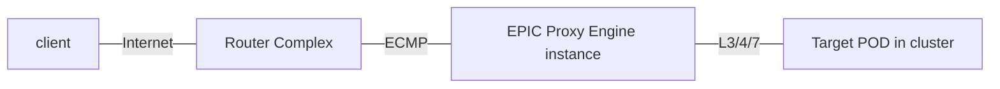

A key component of the EPIC gateway is load balancing.  Its an important implementation consideration because the type of load balancing and the number of load balancing functions impacts the response time customers experience.  EPIC and the in-cluster Gateway Controller maximize load balancing distribution and performance while minimizing delay.



The key to EPIC's performance is using routing in combination with a single proxy engine instance, with requires from the proxy engine forwarded directly to the Kubernetes PODs.  

Each Gateway consists of two or more Envoy proxy engine instances.  EPIC creates proxy instances distributed among multiple compute nodes, each of these proxy instances in programed uniformly.  The public IP address assigned to each gateway is reused in on all proxy instances.  Once the proxy engine is ready for service, that address is distributed to the access router complex using BGP.  Using Equal Cost Multipath, routers distribute traffic among the proxy engine instances.  

The initial ECMP load balancing is key to providing performance and reliability.  ECMP in router/switches is an efficent hardware function and does not add any delay in the forwarding forwarding of packets.  Our internal BGP implementation ensures that any EPIC node failures are immediately propogated to the router complex ensuring rapid recovery.

The second component of Load Balancing is the Envoy proxy engine.  Each proxy engine recieves requests from the router complex and distributes requests among the endpoint programmed by the gateway controller.  Proxy Engines operate at a high level and are based in software, therefore proxy engines introduce some delay in processing.  This delay is dependant on the functionality undertaken by the proxy engine, operating at either L3/4 or L7, and other functionality applied such as Authorization.  EPIC automatically managed proxy engine resource demand to ensure that EPIC nodes to not contribute unnessarly to individual proxy delay.  **A proxy engine is always required, its critical to not have more than one in the path as each adds delay.**

To minimize delay, its important to ensure that requests do not transit additional proxies in the Kubernetes cluster.  Requests leaving the proxy instances have the destination address of the POD Endpoint, an address on the cluster CNI network.  EPIC and the Gateway Controller encapsulate and decapsulate the requests from transport between EPIC and the target cluster node.  This service encapsulation is developed using eBPF and is a simple program that does not add measurable additional delay.


```mermaid
graph LR

I((Internet)) --- A1
I --- A2
A1([Router A]) --- B1
A1 --- B2
A1 --- B3
A2([Router B]) --- B1
A2 --- B2
A2 --- B3


B1([Proxy Engine 1]) --- C1
B1 --- C2
B1 --- C3
B2([Proxy Engine 2]) --- C1
B2 --- C2
B2 --- C3
B3([Proxy Engine 3]) --- C1
B3 --- C2
B3 --- C3


C1[POD 1]
C2[POD 2]
C3[POD 3]

subgraph EPIC
  subgraph Node 1 
  B1
  end
  subgraph Node 2
   B2
  end
  subgraph Node 3
   B3
  end
end

subgraph k8s Cluster
  subgraph Node 1
   C1
  end
  subgraph Node 2
   C2
  end
  subgraph Node 3
   C3
  end
end

 ```


This design provides maximum total performance while limiting individual request delay resulting in scalable API Gateways that deliver the highest possible customer experience