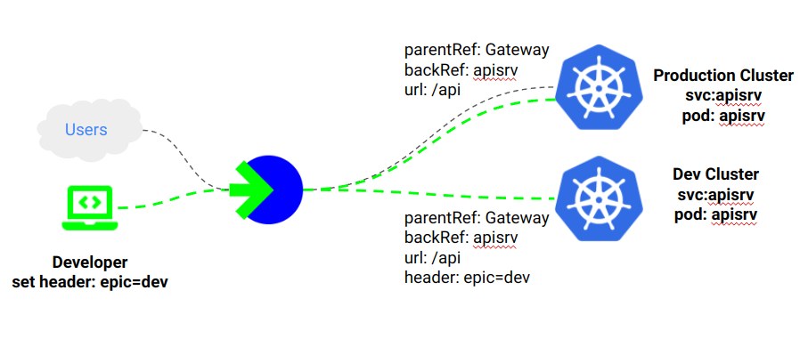
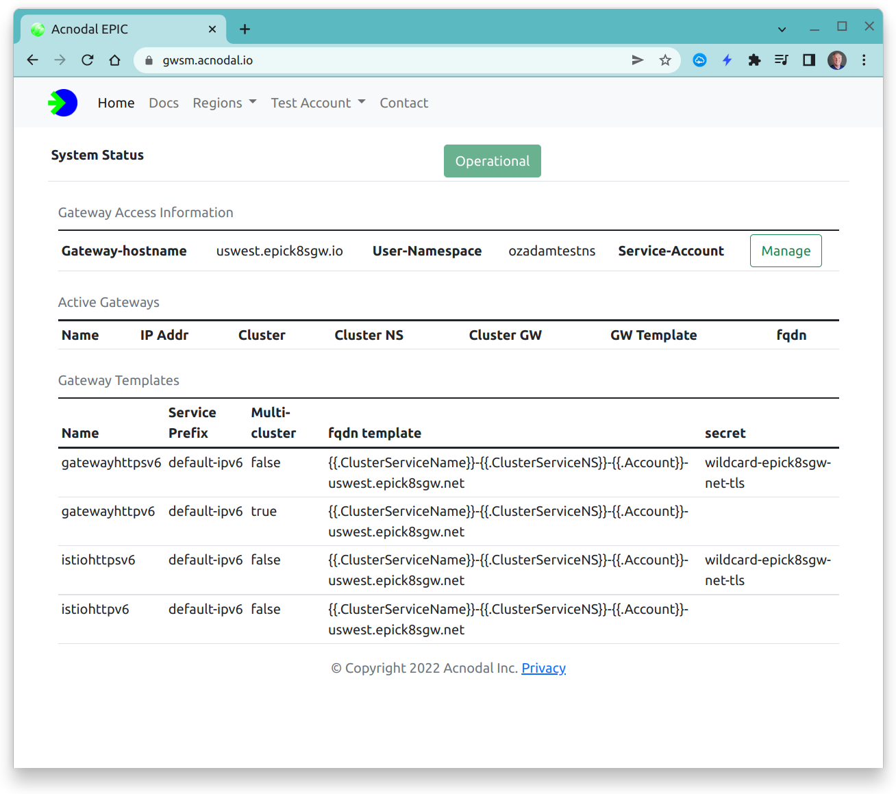
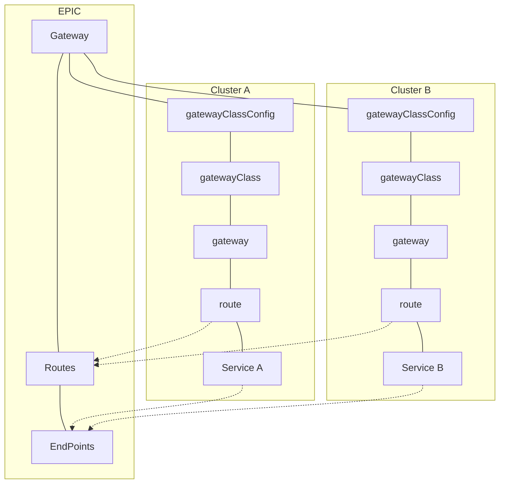
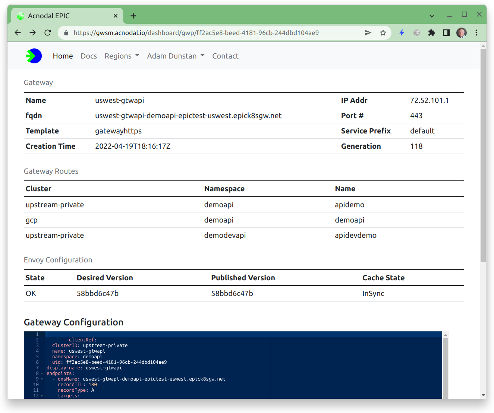
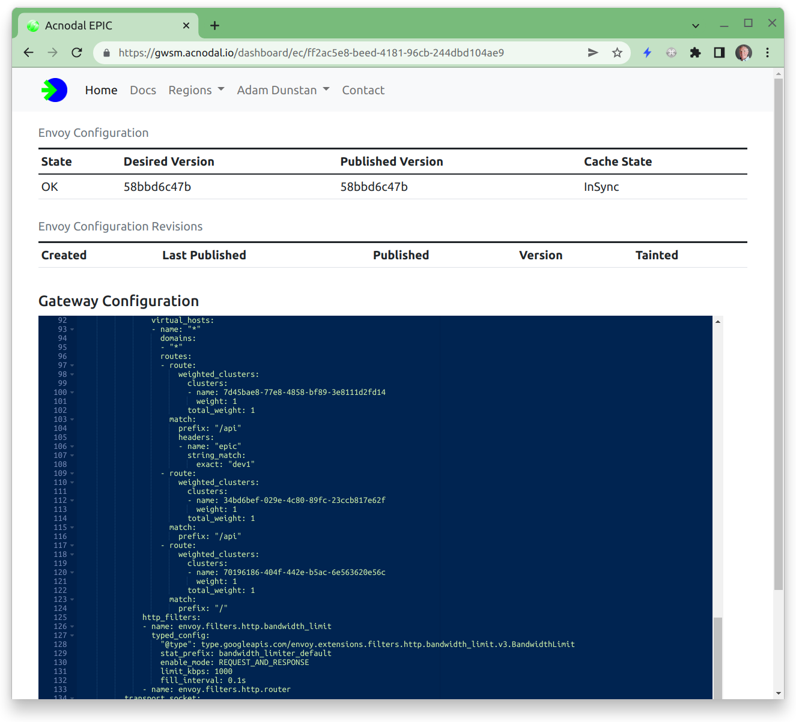

EPIC supports multi-cloud, multi-cluster.  A Gateway can be shared among multiple clusters.  The routes created in each cluster are merged by EPIC.  A route can be used to direct request to a backend in a specific cluster or used to load balance request across clusters.

<p align="center">

</p>


{}
Multi-cluster must be enabled in the Gateway Template
{}


To create a shared Gateway, the Gateway template must have Multi-cluster sharing enabled as shown in the template *gatewayhttpv6* below and each cluster must have a service account in the EPIC namespace.

<p align="center">

</p>

The diagram below shows the relationship between the resources in the EPIC and the clusters.  The structure of objects in EPIC logically mirrors the structure in the cluster so that the relationship between resources can be easily identified.


The first cluster creates the initial gateway, assuming the gateway is shared, subsequent gateways reference the initial gateway.


## Cluster Configuration.
Both clusters create a *GatewayClassConfig* that references the same EPIC gateway template, and create a *GatewayClass*


The initial gateway is created and the sharing key used to attached to that gateway is contained in the status of the original gateway.  Any number of cluster gateways can be attached to the EPIC gateway using the sharing key


```yaml
- apiVersion: gateway.networking.k8s.io/v1alpha2
  kind: Gateway
  metadata:
    annotations:
      acnodal.io/epic-config: epic-gateway/uswest-gtwapi
      acnodal.io/epic-link: /api/epic/accounts/epictest/proxies/ff2ac5e8-beed-4181-96cb-244dbd104ae9
      kubectl.kubernetes.io/last-applied-configuration: |
        {"apiVersion":"gateway.networking.k8s.io/v1alpha2","kind":"Gateway","metadata":{"annotations":{},"name":"uswest-gtwapi","namespace":"demoapi"},"spec":{"gatewayClassName":"uswest-gtwapi","listeners":[{"allowedRoutes":{"namespaces":{"from":"All"}},"name":"gwapi","port":443,"protocol":"HTTPS"}]}}
    creationTimestamp: "2022-04-19T18:16:17Z"
    finalizers:
    - epic.acnodal.io/controller
    generation: 1
    name: uswest-gtwapi
    namespace: demoapi
    resourceVersion: "2543805"
    uid: ff2ac5e8-beed-4181-96cb-244dbd104ae9  <-- sharing key
  spec:
    gatewayClassName: uswest-gtwapi
    listeners:
    - allowedRoutes:
        namespaces:
          from: All
      name: gwapi
      port: 443
      protocol: HTTPS
  status:
    addresses:
    - type: IPAddress
      value: 72.52.101.1
    - type: Hostname
      value: uswest-gtwapi-demoapi-epictest-uswest.epick8sgw.net
    conditions:
    - lastTransitionTime: "2022-04-19T18:16:17Z"
      message: Announced to EPIC
      observedGeneration: 1
      reason: Valid
      status: "True"
      type: Ready
```


Above is the initial gateway to be shared, the sharing key is contained in  *metadata.uuid*

The uuid is added to the metadata annotation *acnodal.io/epic-sharing-key*
as per below.

```yaml
- apiVersion: gateway.networking.k8s.io/v1alpha2
  kind: Gateway
  metadata:
    annotations:
      acnodal.io/epic-config: epic-gateway/uswest-gtwapi
      acnodal.io/epic-link: /api/epic/accounts/epictest/proxies/ff2ac5e8-beed-4181-96cb-244dbd104ae9
      acnodal.io/epic-sharing-key: ff2ac5e8-beed-4181-96cb-244dbd104ae9
      kubectl.kubernetes.io/last-applied-configuration: |
        {"apiVersion":"gateway.networking.k8s.io/v1alpha2","kind":"Gateway","metadata":{"annotations":{"acnodal.io/epic-sharing-key":"ff2ac5e8-beed-4181-96cb-244dbd104ae9"},"name":"uswest-gtwapi","namespace":"demoapi"},"spec":{"gatewayClassName":"uswest-gtwapi","listeners":[{"allowedRoutes":{"namespaces":{"from":"All"}},"name":"gwapi","port":443,"protocol":"HTTPS"}]}}
    creationTimestamp: "2022-04-19T18:23:15Z"
    finalizers:
    - epic.acnodal.io/controller
    generation: 1
    name: uswest-gtwapi
    namespace: demoapi
    resourceVersion: "5256593"
    uid: afef5e7a-10c4-4659-b94d-69ff0d3460e0
  spec:
    gatewayClassName: uswest-gtwapi
    listeners:
    - allowedRoutes:
        namespaces:
          from: All
      name: gwapi
      port: 443
      protocol: HTTPS
  status:
    addresses:
    - type: IPAddress
      value: 72.52.101.1
    - type: Hostname
      value: uswest-gtwapi-demoapi-epictest-uswest.epick8sgw.net
    conditions:
    - lastTransitionTime: "2022-04-19T18:23:16Z"
      message: Announced to EPIC
      observedGeneration: 1
      reason: Valid
      status: "True"
      type: Ready
```

Both Gateways will share the same EPIC gateway configuration including IP Address and FQDN.  httpRoutes added to the gateway object in each cluster are merged by EPIC into a single route configuration.

The Gateway Service Manager will show multiple Gateway Routes for the gateway.  the example below shows three gateway routes with two different clusters for the EPIC Gateway.


<p align="center">

</p>


The Envoy configuration shows the resulting merged route configuration.

<p align="center">

</p>


