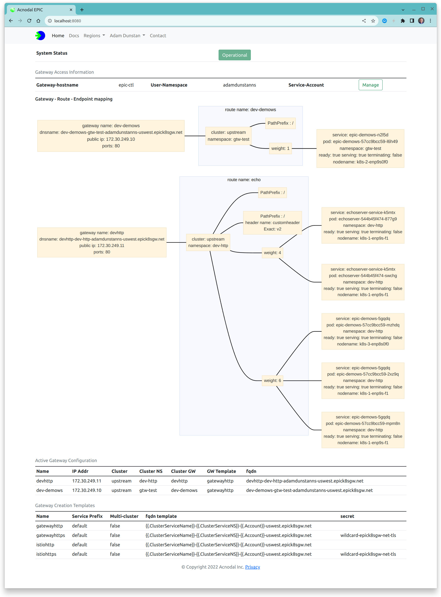

The Gateway API has more components than the Ingress or Service LoadBalancer API that need to be configured correctly to create a working Gateway.  The Acnodal Gateway Controller installed on the target cluster gathers gateway, router and service objects in addition to endpoint object forwarding this information to the EPIC gateway to construct and maintain the the Gateway.

The Gateway API represents the desired state of the Gateway, EPIC contains the actual state of the Gateway and the Gateway Service Manager represents this state in a simple, dynamic graphic so that the Gateways complete configuration and operational state can be viewed in one place.

To simplify operation and troubleshooting EPIC merges information sent by the target cluster with the information used to create the gateway to provide a representation of the a Gateway that reflects the Gateway API structure and include key operational information about the gateway. 

The structure is similar to the Gateway API displaying external gateway information, the key information regarding request routing and request distribution. 

Service Endpoints are dynamic and EPIC requires Endpoint information to forward requests to POD endpoints.  EPIC stores additional information about the Endpoint referenced PODs, adding this information to the visualization to provide a complete view of each Gateway.  Updates made in the target cluster are dynamically updated in EPIC and the Gateway Service Manager.

The configuration complete Gateway can also be inspected, providing the Gateway and created Envoy configuration that is used to create one or more uService Envoy proxies.

