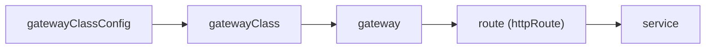

Multi-cloud support is the same as multi-cluster support.  No additional components or specific installation is required to enable multi-cluster, simply install the Gateway controller in each cluster.


The EPIC Gateway template and EPIC Gateway configuration includes the configuration object *can-be-shared*.  This is set in the EPIC Gateway, it cannot be set from the cluster GatewayAPI.  When set to *true* the gateway can be shared.  


<p align="center">

</p>


The screenshot above shows the Gateway Templates in the Gateway Service Manager, note the *gatewayhttps* and *istiohttps* are show as *Multi-cluster true* reflecting *can-be-shared: true* in the template.


### The Cluster Gateway Resources

A Gateway constructed from a set of resources.  



The initial cluster Gateway resource and EPIC Gateway are created, then the subsequent cluster Gateway resources.   In each cluster the *gatewayClassConfig* and *gatewayClass* should be the same.  These names are not used by EPIC in the process of merging the gateway and its routes, but are enforced to make it easier to troubleshoot and display in the EPIC Console.

The existing EPIC Gateway to be shared is referenced by it EPIC Gateway UUID.  This


```yaml
apiVersion: gateway.networking.k8s.io/v1alpha2
kind: Gateway
metadata:
  annotations:
    acnodal.io/epic-config: epic-gateway/uswest-gtwapi
    acnodal.io/epic-link: /api/epic/accounts/epictest/proxies/ff2ac5e8-beed-4181-96cb-244dbd104ae9
    kubectl.kubernetes.io/last-applied-configuration: |
      {"apiVersion":"gateway.networking.k8s.io/v1alpha2","kind":"Gateway","metadata":{"annotations":{},"name":"uswest-gtwapi","namespace":"demoapi"},"spec":{"gatewayClassName":"uswest-gtwapi","listeners":[{"allowedRoutes":{"namespaces":{"from":"All"}},"name":"gwapi","port":443,"protocol":"HTTPS"}]}}
  creationTimestamp: "2022-04-19T18:16:17Z"
  finalizers:
  - epic.acnodal.io/controller
  generation: 1
  name: uswest-gtwapi
  namespace: demoapi
  resourceVersion: "2543805"
  uid: ff2ac5e8-beed-4181-96cb-244dbd104ae9
spec:
  gatewayClassName: uswest-gtwapi
  listeners:
  - allowedRoutes:
      namespaces:
        from: All
    name: gwapi
    port: 443
    protocol: HTTPS
status:
  addresses:
  - type: IPAddress
    value: 72.52.101.1
  - type: Hostname
    value: uswest-gtwapi-demoapi-epictest-uswest.epick8sgw.net
  conditions:
  - lastTransitionTime: "2022-04-19T18:16:17Z"
    message: Announced to EPIC
    observedGeneration: 1
    reason: Valid
    status: "True"
    type: Ready
```

To share this gateway, the subsequent *gateway* resources adds the UUID to the new Gateway using the annotation *acnodal.io/epic-sharing-key*  In these examples, two clusters, one upsteam on bare metal and the other on GCP are sharing this Gateway.

```yaml
apiVersion: gateway.networking.k8s.io/v1alpha2
kind: Gateway
metadata:
  annotations:
    acnodal.io/epic-config: epic-gateway/uswest-gtwapi
    acnodal.io/epic-link: /api/epic/accounts/epictest/proxies/ff2ac5e8-beed-4181-96cb-244dbd104ae9
    acnodal.io/epic-sharing-key: ff2ac5e8-beed-4181-96cb-244dbd104ae9
    kubectl.kubernetes.io/last-applied-configuration: |
      {"apiVersion":"gateway.networking.k8s.io/v1alpha2","kind":"Gateway","metadata":{"annotations":{"acnodal.io/epic-sharing-key":"ff2ac5e8-beed-4181-96cb-244dbd104ae9"},"name":"uswest-gtwapi","namespace":"demoapi"},"spec":{"gatewayClassName":"uswest-gtwapi","listeners":[{"allowedRoutes":{"namespaces":{"from":"All"}},"name":"gwapi","port":443,"protocol":"HTTPS"}]}}
  creationTimestamp: "2022-04-19T18:23:15Z"
  finalizers:
  - epic.acnodal.io/controller
  generation: 1
  name: uswest-gtwapi
  namespace: demoapi
  resourceVersion: "5256593"
  uid: afef5e7a-10c4-4659-b94d-69ff0d3460e0
spec:
  gatewayClassName: uswest-gtwapi
  listeners:
  - allowedRoutes:
      namespaces:
        from: All
    name: gwapi
    port: 443
    protocol: HTTPS
status:
  addresses:
  - type: IPAddress
    value: 72.52.101.1
  - type: Hostname
    value: uswest-gtwapi-demoapi-epictest-uswest.epick8sgw.net
  conditions:
  - lastTransitionTime: "2022-04-19T18:23:16Z"
    message: Announced to EPIC
    observedGeneration: 1
    reason: Valid
    status: "True"
    type: Ready
```

The gateway and route resources do not need to share the same names, they should reflect configuration that makes sense in your application. 


### How EPIC implements a Multicluster Gateway
Creating a cluster *gateway* resource instantiates at an EPIC Gateway instance based upon the gateway template.  EPIC has controllers that dynamically update the initial Envoy Configuration.   The endpoint controller that maintains the list of POD IP addresses in the cluster.  It includes an Envoy End Point Discover Server that updates Envoys *cluster* configuration.   Endpoints from each cluster are added by the endpoint controller.

Single cluster *gateway* resources can be referenced by multiple route objects.  Multicluster uses the same logic.  According to rules is the GatewayAPI, cluster *httproute* are merged and converted into the EPIC Gateways Envoys filter_chains.  The resulting Envoy Configuration can be inspected using the Gateway Service Manager 

```yaml
envoyAPI: v3
envoyResources:
  clusters:
    - name: 7d45bae8-77e8-4858-bf89-3e8111d2fd14
      value: |
        name: 7d45bae8-77e8-4858-bf89-3e8111d2fd14
        connect_timeout: 2s
        type: EDS
        eds_cluster_config:
          eds_config:
            resource_api_version: V3
            api_config_source:
              api_type: GRPC
              transport_api_version: V3
              grpc_services:
              - envoy_grpc:
                  cluster_name: eds-server
        lb_policy: ROUND_ROBIN
        health_checks:
        - interval: 5s
          timeout: 5s
          no_traffic_interval: 5s
          unhealthy_threshold: 3
          healthy_threshold: 3
          tcp_health_check: {}
    - name: 34bd6bef-029e-4c80-89fc-23ccb817e62f
      value: |
        name: 34bd6bef-029e-4c80-89fc-23ccb817e62f
        connect_timeout: 2s
        type: EDS
        eds_cluster_config:
          eds_config:
            resource_api_version: V3
            api_config_source:
              api_type: GRPC
              transport_api_version: V3
              grpc_services:
              - envoy_grpc:
                  cluster_name: eds-server
        lb_policy: ROUND_ROBIN
        health_checks:
        - interval: 5s
          timeout: 5s
          no_traffic_interval: 5s
          unhealthy_threshold: 3
          healthy_threshold: 3
          tcp_health_check: {}
    - name: 70196186-404f-442e-b5ac-6e563620e56c
      value: |
        name: 70196186-404f-442e-b5ac-6e563620e56c
        connect_timeout: 2s
        type: EDS
        eds_cluster_config:
          eds_config:
            resource_api_version: V3
            api_config_source:
              api_type: GRPC
              transport_api_version: V3
              grpc_services:
              - envoy_grpc:
                  cluster_name: eds-server
        lb_policy: ROUND_ROBIN
        health_checks:
        - interval: 5s
          timeout: 5s
          no_traffic_interval: 5s
          unhealthy_threshold: 3
          healthy_threshold: 3
          tcp_health_check: {}
  listeners:
    - name: TCP-443
      value: |
        name: TCP-443
        address:
          socket_address:
            address: "::"
            ipv4_compat: yes
            port_value: 443
            protocol: TCP
        filter_chains:
        - filters:
          - name: envoy.http_connection_manager
            typed_config:
              "@type": type.googleapis.com/envoy.extensions.filters.network.http_connection_manager.v3.HttpConnectionManager
              stat_prefix: ff2ac5e8-beed-4181-96cb-244dbd104ae9
              server_name: epicuswest
              add_user_agent: true
              use_remote_address: true
              via: epicuswest
              route_config:
                name: local_route
                virtual_hosts:
                - name: "*"
                  domains:
                  - "*"
                  routes:
                  - route:
                      weighted_clusters:
                        clusters:
                        - name: 7d45bae8-77e8-4858-bf89-3e8111d2fd14
                          weight: 1
                        total_weight: 1
                    match:
                      prefix: "/api"
                      headers:
                      - name: "epic"
                        string_match:
                          exact: "dev1"
                  - route:
                      weighted_clusters:
                        clusters:
                        - name: 34bd6bef-029e-4c80-89fc-23ccb817e62f
                          weight: 1
                        total_weight: 1
                    match:
                      prefix: "/api"
                  - route:
                      weighted_clusters:
                        clusters:
                        - name: 70196186-404f-442e-b5ac-6e563620e56c
                          weight: 1
                        total_weight: 1
                    match:
                      prefix: "/"
              http_filters:
              - name: envoy.filters.http.bandwidth_limit
                typed_config:
                  "@type": type.googleapis.com/envoy.extensions.filters.http.bandwidth_limit.v3.BandwidthLimit
                  stat_prefix: bandwidth_limiter_default
                  enable_mode: REQUEST_AND_RESPONSE
                  limit_kbps: 1000
                  fill_interval: 0.1s
              - name: envoy.filters.http.router
          transport_socket:
            name: envoy.transport_socket.tls
            typed_config:
              "@type": type.googleapis.com/envoy.extensions.transport_sockets.tls.v3.DownstreamTlsContext
              common_tls_context:
                  tls_certificate_sds_secret_configs:
                    - name: wildcard-https-cert
                      sds_config:
                        resource_api_version: V3
                        ads: {}
  secrets:
    - name: wildcard-https-cert
      ref:
        name: wildcard-epick8sgw-net-tls
        namespace: epic-epictest
nodeID: epic-epictest.ff2ac5e8-beed-4181-96cb-244dbd104ae9
serialization: yaml

```


### Request Distribution
The distribution of requests among clusters is controlled via the cluster Gateway controller.  For example, scaling a deployment in one of the clusters will result in a larger percentage of traffic being sent to that cluster.  

Using *httpRoute backendRefs weight* provides more granular control over the distribution amount Services/PODs.  When EPIC merges the routing rules, it will create a weight from the combined rules.  For example, if each cluster has a rule with 100%, each cluster will receive 50%.  EPIC sums the weights on each *backendRef* and creates a distribution that equals 100%

*httpRoute* can also be used to distribute specific requests to different clusters, creating a unique *httpRoute* in a cluster will result requests being forward to that cluster.


### More Information
Additional information is available in the [Multi-cluster documentation.]()  


