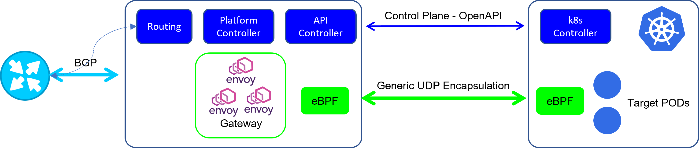
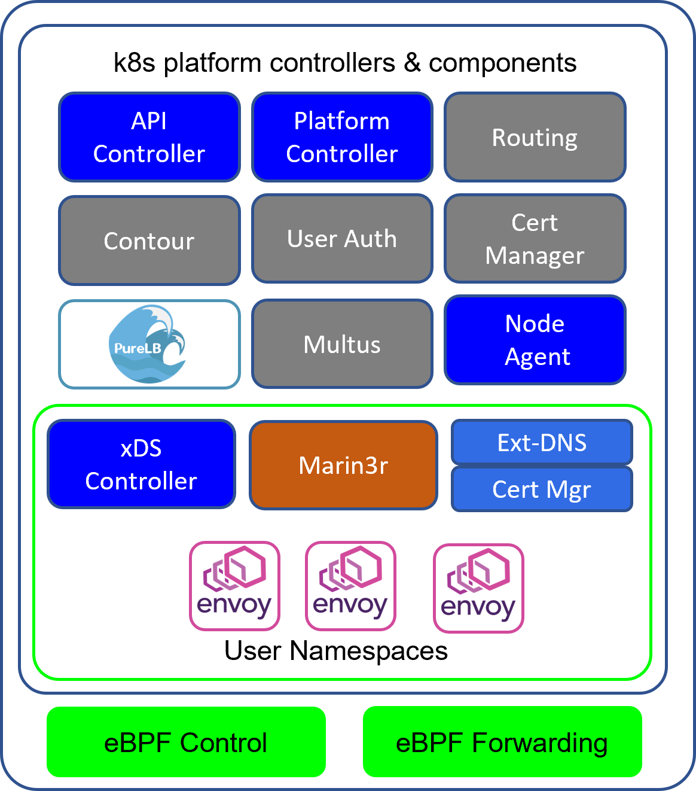
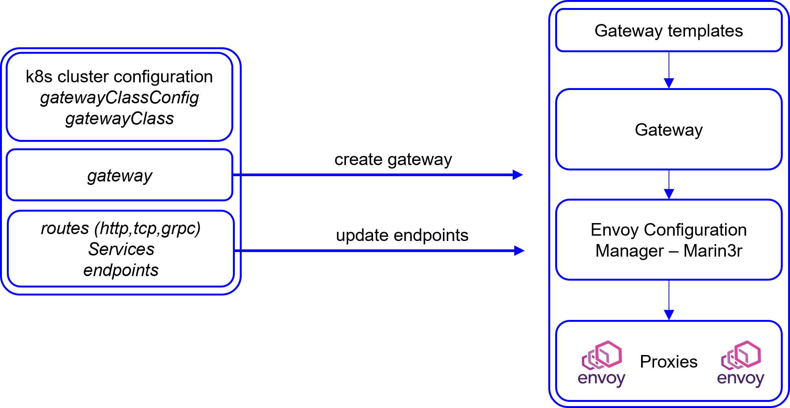
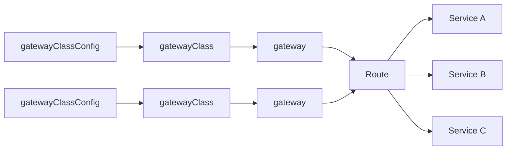
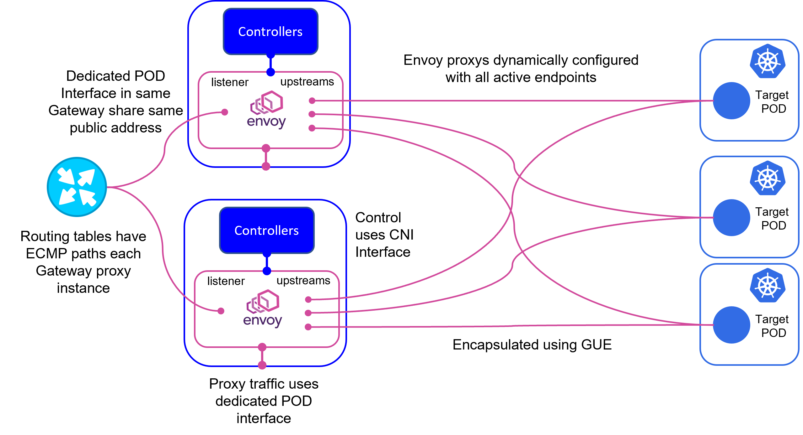

## Introduction
The EPIC platform consists of a Gateway cluster and controllers that use the Gateway.  There are two client controllers, a k8s controller used in conjunction with Kubernetes workload clusters and a native linux controller for use on non-k8s clusters.

As the platform was developed in using k8s as infrastructure, the majority of the developed code is in GoLang, there are some utilities in Python and the network transport code is developed using eBFP.

Communications between Gateway Clusters consists of a control plane implemented as an OpenAPI rest interface and the dataplane used to carry request traffic encapsulated ing Generic UDP encapsulation.

## Gateway Components
The Gateway components are installed on an upstream version of Kubernetes.  The installation procedure adds all of the necessary k8s components and gateway components.  The platform consists of a number of integrated and developed components that together automate the process of creating API Gateways on demand triggered by the client controllers.

### k8s Base
The base k8s cluster is a generic cluster.  The installation adds the CNI, flannel is used.  The CNI is not used for gateway proxy communications, its purpose is a control plane only therefore their is no performance requirements.

### Global Components
There are a number of components used globally by the system.

* API Controller.  Provides the API used by the client to communicate with the gateway
* Platform Controller.  Orchestrates the creation of Gateways and their proxy instances
* Node Agent. Manages the creation of eBPF transport
* Multus.  Adds an additional interface to each proxy pod providing the communication path for request/response traffic
* Contour/PureLB.  This LoadBalancer/Ingress combination provides access to the API controller
* User Auth.  User Groups are allocated to Namespaces, this component provides simple password based access control in combination with Contour
* Platform Cert Manager.  This iteration of Cert Manager provides Certs for access to the API controller via Contour/Purelb
* Routing.  When Gateways are created, the routing container in each node is configured to advertize the route to the upstream router.  This exposes the gateway and where there are multiple cluster nodes and gateways created with multiple envoy proxies creates a load balancing structure.

### Namespace Components
Each user namespace has a set of components that operate alongside the gateway proxies in the namespace.

* Marin3r.  This is a component that provides configuration management for Envoy.  Its most important role is verifying the Envoy configuration to ensure that only valid configurations are applied.  It stores envoy configuration history and displays the actual envoy configuration loaded.
* xDS Controller.  This controller bootstraps and provides dynamic configuration of each envoy instance.  Dynamic actions such as adding and removing POD endpoints are managed by this controller.
* Cert Manager.  This iteration of Cert Manager is used for Gateways in each namespace
* Ext-DNS.  This controller updates external DNS servers on creation of gateways based upon Gateway Template configuration
* Envoy Instances.  These are the proxy engine instance for each Gateway.  The Gateway configuration (yaml) has a configuration parameter that specifies the number of proxy (envoy) instances per Gateway, k8s is configured to distribute them among nodes if possible. Each user namespace can have multiple gateways and therefore many proxy instances.

### Network/Request Transport
The control plane programs each Envoy instance with the upstream POD address.  This address is internal to the cluster and not accessible externally.  The Generic UDP transport encapsulates these request and forwarded them to a publicly reachable address of the k8s node containing the target POD.  This is implemented using eBPF.  There is a control program that configures the eBPF forwarding behavior and the eBPF code attached logical and physical interfaces using the Traffic Control hook.

The Generic UDP encapsulation used is not the Linux kernel implementation referred to as FOU (foo over UDP).  GUE has two variants, one with an additional control packet format and an additional control header.  The variant in the Linux Kernel is the simple encapsulation version that does not support control packets or the additional control headers.  EPIC uses the variant with additional control packets and headers to verify the source of data in the forwarding path.

The control plane forwards target POD addressing necessary to configure Envoy, however the target Node addresses are usually behind firewalls.  Upon initial Gateway creation in the workload clusters, the Gateway controller begin sending periodic GUE control packets. THe eBPF code uses the information in the control header to match the outer source IP address with a gateway so that this address, most likely allocated by a NAT can be used as the workload cluster node target address.

## IPv6 and IPv4
Gateways can be created with either IPv4 or IPv6 public addresses.  Communication to upstream nodes and endpoints is supported using IPv4 only.

## Gateway Creation
A namespace is created for each Gateway Cluster user, a CLI is provided that includes a namespace creation command that populates the namespace with the necessary configuration and components required.  (the Gateway Service Manager also provides this functionality)

To create a Gateway, the EPIC cluster user namespace must have a Gateway Template that provides the base for the Gateway configuration.  This template includes networking information (IPAM and DNS), proxy information and the configuration used to base the Envoy proxies.  The template uses Golang templates to allow information from the EPIC cluster and workload clusters into the templates.

The k8s cluster controller is configured with a GatewayClassConfig containing EPIC cluster configuration and the template to be used for creation and then its made available to the k8s gatewayAPI by created a gatewayClass.  

In the workload cluster user namespace the creation of a GatewayAPI gateway object will initiate the creation of a gateway in the EPIC cluster from the specified template.  In the EPIC cluster a new gatewayProxy object is created containing the configuration for the new gateway and using this object envoy pods are created with the specific network configuration and bootstrapped.  The Marin3r controller is updated with an Envoy configuration from the gatewayProxy object with only the envoy configuration. Once operational these envoy pods retrieve their configuration using XDS from the Marin3R controller. 

### Gateway, Route & Service Structure
The workload cluster contains objects defined by the EPIC controller and the gatewayAPI.  

The Route object is the central element in the structure, it connects gateways and services.  EPIC supports httpRoute and tcpRoute.When route objects are created, the k8s cluster controller provides the information necessary to the EPIC cluster to update endpoints.  As PODs are added and removed from services, the controller updates Envoy adding or removing endpoints from the Gateway and its envoy instances.

## Operational Diagram

The diagram above illustrates operation of a EPIC Gateway clusters with two node, operating a Gateway with two Envoy instances forwarding requests to three target pods.  

Initial load balancing between Envoy instances for request traffic is undertaken by the upstream router using Equal Cost Multipath.  The EPIC cluster IPAM and Multus allocate the same public address to both Envoy POD instances.

Each Envoy POD in the gateway is configured with upstream endpoints consisting of the POD ip address.  Each instance distributes its request load based upon the load balancing mechanism defined in the envoy configuration.

Should a EPIC cluster node or Gateway POD instance fail, the route advertized to the upstream router is withdrawn and traffic is sent to the remaining Gateway Envoy instance.
