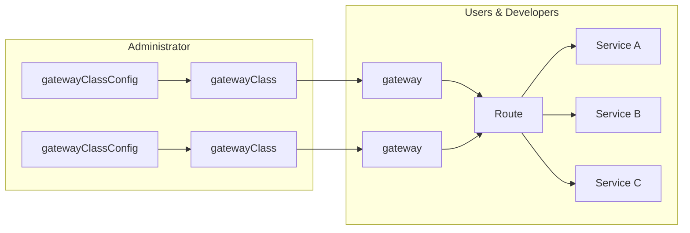

To configure and communicate with the Gateway a Gateway controller is installed on the cluster.  The installation consists of support for a specific version of the standard GatewayAPI that support specific features enabled by EPIC and the EPIC gateway controller (pure-gateway)


The definition of Gateways is logically separated into activities: the creation of GatewayClassConfig & GatewayClass, and the creation of the gateway and its associated routes.



| Resource | Scope | Source | Description |
|----------|-------|--------|-------------|
| gatewayclassconfig | namespace | controller | Configuration specific to the target EPIC, namespace & template|
| gatewayclass | global | k8s Gateway API | Makes the gateway defined in the gateway class available to users |
| gateway | namespace | k8s Gateway API | A gateway created from the a gateway class |
| httproute | namespace | k8s Gateway API | Support http rules connecting gateways and services |
| tcproute | namespace | k8s Gateway API | Connects gateways and services |
| service | namespace | k8s API | Exposing POD protocols & ports |


## Installation
The k8s Gateway API and Gateway Controller (pure-gw) are installed using the following manifests.

```bash
$ kubectl apply -f https://github.com/kubernetes-sigs/gateway-api/releases/download/v0.5.1/experimental-install.yaml
$ kubectl apply -f https://github.com/epic-gateway/pure-gateway/releases/download/v0.24.0/pure-gateway.yaml
```


## Configuration

For each class of gateway created a ```gatewayclassconfig``` resource is created.  This resource provides the configuration necessary to create a gateway from a referenced gateway class.  There are components in the configuration.  

```yaml
apiVersion: puregw.acnodal.io/v1
kind: GatewayClassConfig
metadata:
  name: gatewayhttp
  namespace: epic-gateway
spec:
  epic:
    user-namespace: root
    service-account: user1
    service-key: yourservicekey

    gateway-hostname: uswest.epick8sgw.io
    gateway-template: gatewayhttp
    cluster-name: mycluster
  trueIngress:
    decapAttachment:
      direction: ingress
      interface: default
      flags: 1
      qid: 0
    encapAttachment:
      direction: egress
      interface: default
      flags: 16
      qid: 1
```


| Object |Description|
|--------|------------|
| user-namespace | The user namespace create on the gateway using *epicctl* (without the epic- prefix) |
| service-account |  The API User account  created in the user namespace on the gateway using *epicctl* |
| service-key | The password created when the API User Account was created on the gateway using *epicctl* |
| gateway-hostname | the hostname for the EPIC gateway's API Service. |
| gateway-template | template (lbsg) located in the user namespace that will be used to create the gateway |
| cluster-name | a name for this cluster that will be displayed in the EPIC Gateway |

{}
The trueIngress section is required but should not require changes.  The specifics of how this is configured are beyond the scope of this documentation.  In short, this is the configuration used to attach the eBPF program that provide Generic UDP encapsulation used by EPIC.  Assuming traffic between cluster and gateway follows the default route, this configuration will work correctly.  If there are multiple interfaces with complex routing, some configuration may be necessary, most likely the specification of the interface that traffic will transit between cluster and gateway in the ```interface``` object.
{}


The ```gatewayclass``` object binds the ```gatewayclassconfig``` object and is referenced when creating a gateway.  

```yaml
apiVersion: gateway.networking.k8s.io/v1alpha2
kind: GatewayClass
metadata:
  name: gatewayhttp
spec:
  controllerName: acnodal.io/epic
  parametersRef:
    name: gatewayhttp
    namespace: epic-gateway
    group: puregw.acnodal.io
    kind: GatewayClassConfig

```

The creation of a ```gatewayclassconfig``` and ```gatewayclass``` tests communications to the EPIC cluster.  The status section of these resources will indicate success or failure to connect to the defined EPIC cluster.

Assuming EPIC connection has succeeded, users of the k8s workload cluster can now create gateways.


## Creating a Gateway & Routes
Users create gateways in their namespaces along with routes. By default gateways are only accessable by routes in the same namespace however the ```gateway``` resource can be configured to allow access from other namespaces sharing the gateway within the cluster.  EPIC also provides a mechanism to share gateways across multiple customers and Linux hosts. 


```yaml
apiVersion: gateway.networking.k8s.io/v1alpha2
kind: Gateway
metadata:
  name: sample-gateway
  namespace: default
spec:
  gatewayClassName: gatewayhttp
  listeners:
  - protocol: HTTP
    port: 80
    name: gwdev-web
```
This will create a gateway called *sample-gateway* based upon the ```gatewayclassconfig``` referenced by the configured ```gatewayclass```

```bash
$ kubectl get gtw
NAME             CLASS         ADDRESS        READY   AGE
sample-gateway   gatewayhttp   192.168.77.2   True    1h
```
The gateway is a separate resource from routes.  This is because the gateway is a slow changing resource while routes can change as the application is developed.  The controller implements status information including generated hostname that can be passed to a DNS server using kubeDNS on either the Gateway or the Workload cluster.  When routes are attached, they are also displayed in the status of the ```gateway``` resource.


Routes bind gateways to services.  In the case of HTTP routes they can also undertake traffic splitting, host matches, path matches and header matches.  Samples of each of these is documented in the (Gateway-as-a-Service User Guide)[/gateway_service/user_usecase/httproutes/]


```yaml
apiVersion: gateway.networking.k8s.io/v1alpha2
kind: HTTPRoute
metadata:
  name: sample-route
  namespace: gtw-test
spec:
  parentRefs:
  - name: sample-gateway
    namespace: default
  rules:
  - backendRefs:
    - name: demows
      namespace: default
      port: 8080
```
The example above is a simple route referencing the *sample-gateway* as the parentRef and the backendRef refer to the service *demows* that exposes port 8080.

Inspecting the httpRoute resource will provide status information including confirmation that the route has been announced to EPIC.

{}
The controller updates EPIC when Endpoints are created, not when services are created.  This is where EPIC gets the POD addresses used to distribute requires to each node/pod combination.  Its good first step in workload cluster debugging is checking that endpoints are present using *kubectl get ep*
{}

## Getting more Information.


A more complex route that includes header matches and path matches is below

```yaml
apiVersion: gateway.networking.k8s.io/v1alpha2
kind: HTTPRoute
metadata:
  name: apidevdemo
  namespace: demodevapi
spec:
  parentRefs:
  - group: gateway.networking.k8s.io
    kind: Gateway
    name: uswest-gtwapi
    namespace: demoapi
  rules:
  - backendRefs:
    - group: ""
      kind: Service
      name: epic-apisrv-v2
      port: 8080
      weight: 1
    matches:
    - headers:
      - name: mycustomheader
        type: Exact
        value: dev-v2

      path:
        type: PathPrefix
        value: /api
```


The syntax of Gateway Resources is defined in the k8s GatewayAPI, EPIC and the Gateway Controller are an implementation of this API. Further information can be found in the [official k8s documentation](https://gateway-api.sigs.k8s.io/)  Note that tcpRoute as well as a number of other capabilities supported are experimental alpha features.

