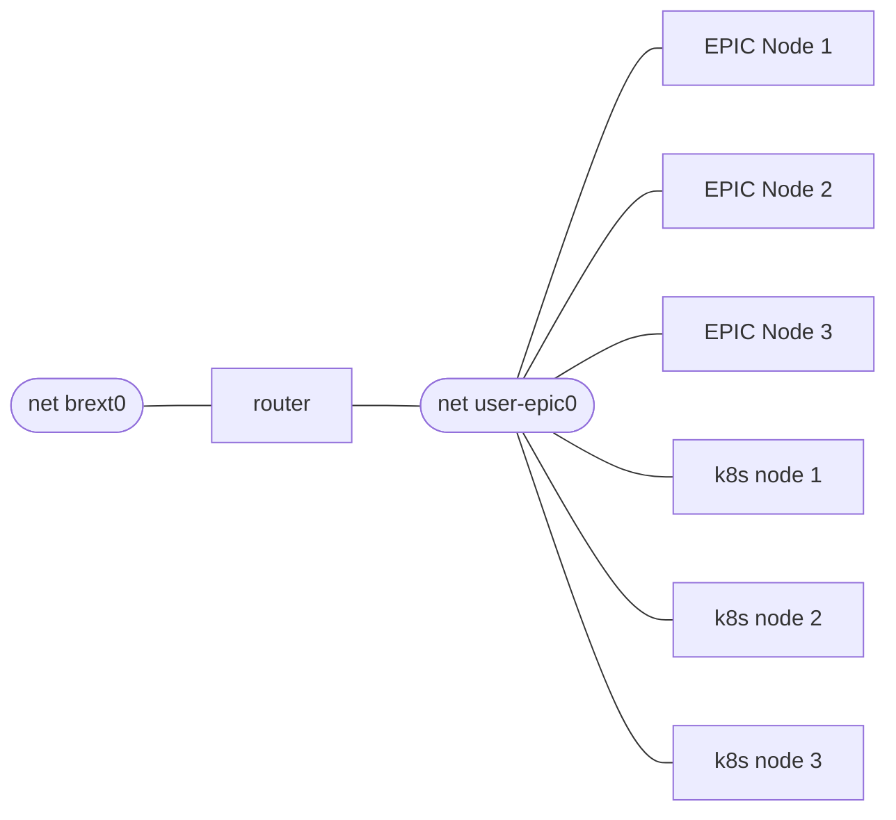

The [dev-test-environment](https://github.com/epic-gateway/dev-test-environment) repo contain prebuilt vagrant environment and is an easy way to try the EPIC platform.  There are two variants, single and multi-node, single node is recommended as a starting point.


## Prerequisites

* Linux host with KVM 
* Vagrant with qemu-kvm support
* Ansible version 2.11 or later

*We have used this with Debian and Ubuntu*

## Single Node
The Single Node environment consists of one EPIC gateway and one workload cluster.  The vagrant scripts for each installs all of the the necessary components.


```bash
vagrant up gateway
```
The script creates the VM, then installs and configures all of the EPIC components, this script can take sometime to run.


```bash
vagrant up gwclient
```

This script creates a VM with a single k8s node and installed the Gateway Controller.


## Multinode
The multinode is more representative of a production environment.




Scripts are provided to create a router vm using frr, 3 node EPIC cluster and 3 node workload cluster.  It requires an additional linux bridge to be configured to operate.

The scripts and instructions are available in the [multinode directory](https://github.com/epic-gateway/dev-test-environment/tree/main/multinode)